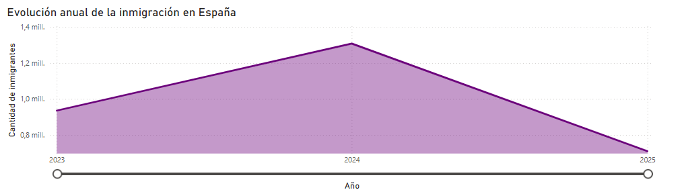
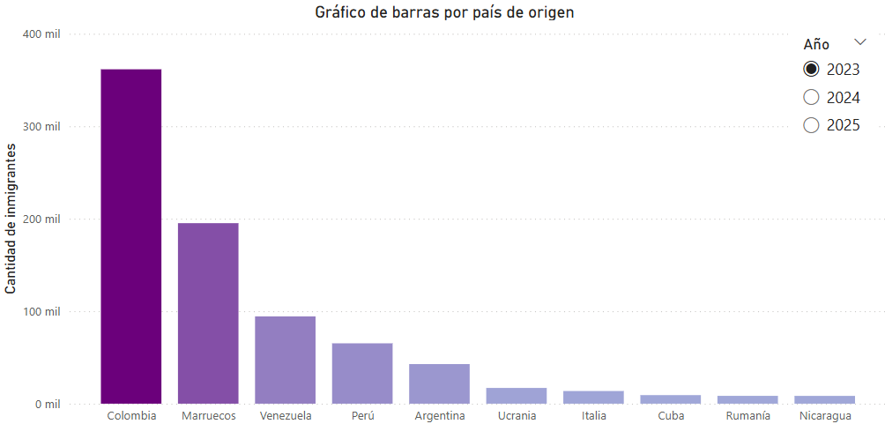
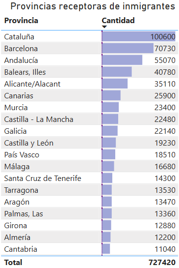
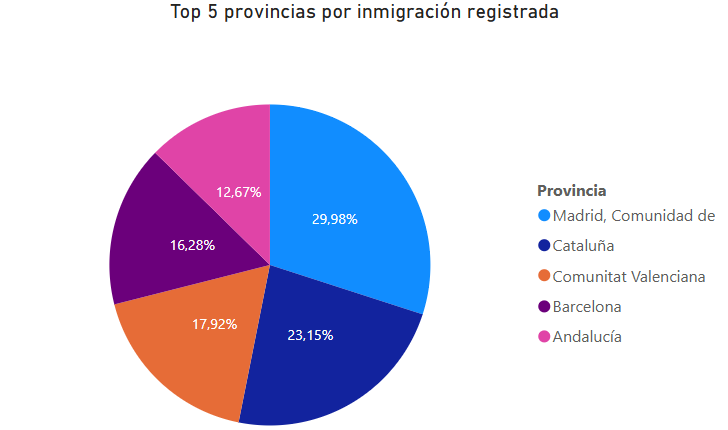
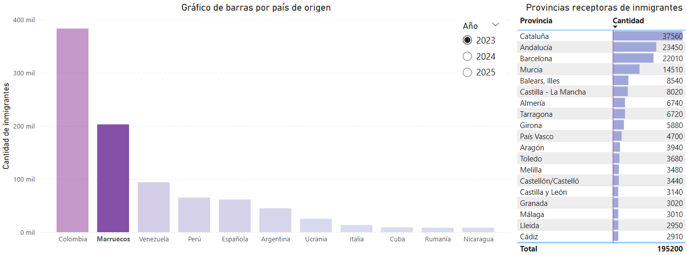

<p align="center" style="font-family: 'Calibri'; font-size:50px; color:#0098CD; font-weight: bold;">Creando un <i>dashboard</i> con Power BI</strong></p>


<div align="center">
  	<a href="https://github.com/JMPinillos/Aprendizaje-automatico-en-practica/tree/main/code/Visualizaci%C3%B3n_de_datos/1-An%C3%A1lisis%20de%20tendencias%20en%20D3.js/code" target="_blank"></a>
  	<a href="https://jmpinillos.github.io/Data-Analyst-para-Inteligencia-Artificial/" target="_blank"></a>
</div>


## 1. INTRODUCCIÓN

La movilidad humana es uno de los fenómenos sociales más relevantes de nuestro tiempo. Lejos de ser una cuestión meramente demográfica, la inmigración y la emigración configuran dinámicas que afectan al desarrollo económico, a la planificación territorial y a la cohesión social de los países. En este contexto, España se presenta tanto como un territorio de acogida como un punto de partida, en el que confluyen personas que llegan en busca de nuevas oportunidades y ciudadanos que emprenden proyectos en el exterior.

Este trabajo tiene como finalidad ofrecer una visión estructurada, interactiva y comprensible de los flujos migratorios registrados en España entre los años 2023 y 2025. A través del desarrollo de un *dashboard* en Power BI, se representan de forma visual y dinámica los datos de inmigración y emigración, atendiendo a aspectos clave como la evolución temporal, la procedencia y el destino de las personas migrantes, así como la distribución territorial dentro del país.

El informe se divide en dos grandes bloques. En primer lugar, se analiza la **inmigración extranjera hacia España**, poniendo el foco en los principales países de origen, las provincias receptoras y las posibles causas que explican los movimientos registrados. En segundo lugar, se estudia la **emigración de ciudadanos españoles al extranjero**, explorando las comunidades autónomas de origen, los destinos más habituales y los factores que pueden estar impulsando esta salida de población.

Cada apartado se apoya en diferentes tipos de visualizaciones, como gráficos de líneas, barras, tartas, mapas coropléticos y tablas, que permiten una exploración interactiva y comparativa de los datos. Asimismo, se ofrece una interpretación cualitativa de los resultados, enmarcando las cifras dentro de los procesos sociales, económicos y geopolíticos que las explican.

El proyecto no solo pretende mostrar información estadística, sino también contribuir a una mejor comprensión de las transformaciones que experimenta la sociedad española como resultado de los movimientos migratorios. A través de una lectura crítica y visual de los datos, se busca generar conocimiento útil para la ciudadanía, los responsables públicos y todos aquellos interesados en los desafíos que plantea la movilidad global en el contexto actual.


## 2. OBJETIVOS

Este trabajo tiene como objetivo central el diseño y elaboración de un *dashboard* interactivo en Power BI que permita visualizar de manera estructurada y accesible los principales indicadores asociados a los flujos migratorios en España entre los años 2023 y 2025.

A través del tratamiento y representación de datos oficiales, se persigue:

- **Organizar la información migratoria** en torno a criterios comparables, facilitando su lectura mediante gráficos, mapas y elementos interactivos que favorezcan el análisis visual.
- **Proporcionar herramientas para la exploración autónoma de los datos**, permitiendo filtrar por año, tipo de migración, provincia o país, y adaptando la representación gráfica a distintos niveles de detalle.
- **Identificar y mostrar los principales focos geográficos** tanto de atracción como de salida de población, poniendo en relación origen y destino en cada tipo de flujo.
- **Ofrecer soporte a la toma de decisiones** en contextos académicos, institucionales o ciudadanos mediante una presentación visual clara, orientada a detectar tendencias, concentraciones y cambios significativos.
- **Valorar la potencialidad de Power BI** como recurso técnico para la representación de fenómenos sociales complejos, destacando sus posibilidades en términos de interactividad, filtrado y conexión entre visualizaciones.

De este modo, el proyecto se plantea como una propuesta práctica y comunicativa que permite no solo consultar datos, sino interactuar con ellos de forma intuitiva, abriendo nuevas vías para el análisis y la reflexión sobre la movilidad de población en el contexto español actual.

 

## 3. DATOS

Los datos utilizados en esta actividad fueron extraídos del [Instituto Nacional de Estadística (INE)](https://www.ine.es/) y se descargaron en formato CSV. El conjunto de datos está compuesto por un total de 156.816 registros distribuidos en cinco columnas:

- **Total nacional**: recoge los nombres de todas las comunidades autónomas y provincias españolas, codificados mediante un identificador de dos dígitos correspondiente al inicio del código postal, seguido del nombre de la provincia.
- **Nacionalidad**: indica la nacionalidad asociada a cada movimiento migratorio, ya sea como país de origen en el caso de la inmigración, o como país de destino en el caso de la emigración.
- **Tipo de migración**: especifica si el registro corresponde a una inmigración (entrada) o a una emigración (salida).
- **Periodo**: muestra la fecha a la que corresponde el dato recogido.
- **Total**: representa el número de personas registradas en cada movimiento migratorio, según la combinación de las variables anteriores.

 

### 3.1   Transformación y limpieza

Una vez importado el conjunto de datos a Power BI, se procedió a la renombración de algunas columnas con el fin de facilitar su interpretación en el entorno de trabajo. En concreto, la columna **Total nacional** se renombró como *Provincia*, y **Tipo de migración** se simplificó como *Tipo*. El resto de los nombres de columnas se mantuvieron sin cambios.

Durante el proceso de limpieza, se detectaron valores no numéricos ("..") en la columna *Total*, lo que impedía su tratamiento como valor cuantitativo. Por ello, dichos valores se reemplazaron por ceros, asegurando la correcta tipificación numérica de la variable.

Para permitir una correcta georreferenciación en los mapas interactivos, fue necesario generar tres nuevas columnas:

- **ProvinciaLimpia**: se creó una columna que elimina los dos dígitos iniciales de la provincia, los cuales representaban el código postal. Esto permite trabajar únicamente con el nombre limpio de la provincia.

  ```DAX
  ProvinciaLimpia  = RIGHT([Provincia], LEN([Provincia]) -  3) 
  ```

  

- **UbicacionCompleta**: se construyó una cadena de texto que concatena el nombre limpio de la provincia con el término "España", separados por coma. Esta transformación evita ambigüedades en el sistema de geolocalización, especialmente en provincias con nombres coincidentes con regiones o países extranjeros. Además, se normaliza el nombre “Rioja, La” como “La Rioja” para cumplir con el formato esperado.

  ```DAX
  UbicacionCompleta = 
  VAR ProvinciaEstandar = 
      SWITCH(
          TRUE(),
          DatosMigratorios[ProvinciaLimpia] = "Rioja, La", "La Rioja",
          DatosMigratorios[ProvinciaLimpia]
      )
  RETURN
      ProvinciaEstandar & ", España"
  ```

  

- **NacionalidadLimpia**: se introdujo esta variable para excluir los registros en los que la nacionalidad indicada era “España” o “Española”, evitando así la duplicación de datos en los análisis de migraciones de entrada y salida.

  ```DAX
  NacionalidadLimpia = 
  VAR Texto = TRIM(DatosMigratorios[Nacionalidad])
  RETURN
      SWITCH(
          TRUE(),
          Texto IN { "España", "Española", "españa", "española" }, "EXCLUIR",
          Texto
      )
  ```


Estas transformaciones permitieron adaptar y normalizar el conjunto de datos para su análisis visual en Power BI, garantizando coherencia en la representación espacial y semántica de las migraciones.


### 3.2  Medidas DAX creadas

Para mejorar la interactividad del *dashboard* y permitir un filtrado más preciso de los datos, se definieron diversas medidas DAX. Estas medidas posibilitan tanto el cálculo agregado como la clasificación dinámica de las variables clave en el análisis migratorio.

- **TotalEmigrantes**: calcula la suma total de personas que emigran, filtrando únicamente los registros clasificados como “Emigración”.

  ```DAX
  TotalEmigrantes = 
  CALCULATE(
      SUM(DatosMigratorios[Total]),
      FILTER(
          DatosMigratorios,
          DatosMigratorios[Tipo] = "Emigración"
      )
  )
  ```

  

- **TotalInmigrantes**: suma el total de personas inmigrantes, considerando únicamente los registros marcados como “Inmigración”.

  ```DAX
  TotalInmigrantes = 
  CALCULATE(
      SUM(DatosMigratorios[Total]),
      DatosMigratorios[Tipo] = "inmigración"
  )
  ```

  

- **RankingPais**: asigna una posición en el ranking a cada país según el número total de emigrantes, excluyendo los valores correspondientes a nacionalidad española para evitar redundancias.

  ```DAX
  RankingPais = 
  VAR NacionalidadActual = TRIM(SELECTEDVALUE(DatosMigratorios[Nacionalidad]))
  VAR TotalActual = [TotalEmigrantes]
  RETURN
      IF(
          NacionalidadActual = "España" || 
          NacionalidadActual = "Española" || 
          TotalActual = 0 || 
          ISBLANK(TotalActual),
          BLANK(),
          RANKX(
              FILTER(
                  ALLSELECTED(DatosMigratorios[Nacionalidad]),
                  [TotalEmigrantes] > 0 &&
                  TRIM(DatosMigratorios[Nacionalidad]) <> "España" &&
                  TRIM(DatosMigratorios[Nacionalidad]) <> "Española"
              ),
              [TotalEmigrantes],
              ,
              DESC,
              DENSE
          )
      )
  ```

  

- **RankingProvincia**: genera un ranking de las provincias españolas en función del número total de inmigrantes.

  ```DAX
  RankingProvincia = 
  RANKX(
      FILTER(
          ALLSELECTED(DatosMigratorios[ProvinciaLimpia]),
          [TotalInmigrantes] > 0
      ),
      [TotalInmigrantes],
      ,
      DESC,
      DENSE
  )
  ```

  

- **EsTop5Pais**: crea una medida binaria que permite identificar si un país se encuentra dentro del Top 5 de países emisores de emigrantes, facilitando así su uso en visualizaciones filtradas.

  ```DAX
  EsTop5Pais = 
  VAR Ranking = [RankingPais]
  RETURN
      IF(
          NOT ISBLANK(Ranking) && Ranking > 0 && Ranking <= 5,
          1,
          0
      )
  ```

  

- **EsTop5Provincia**: indicador lógico que identifica si una provincia se encuentra entre las cinco con mayor número de inmigrantes.

  ```DAX
  EsTop5Provincia = IF([RankingProvincia] <= 5, 1, 0)
  ```


Estas medidas permiten implementar filtros dinámicos, rankings interactivos y visualizaciones específicas para facilitar la interpretación de los patrones migratorios.


### 3.3 Filtros aplicados

Para garantizar la coherencia en la visualización de los datos y evitar duplicidades en las interacciones, se implementó un filtro general aplicable a todas las páginas del informe. Este filtro se basó en la columna *ProvinciaLimpia* y permitió excluir entradas duplicadas como “Madrid” y “Comunidad de Madrid”, o “Valencia” y “Comunidad Valenciana”, que generaban solapamientos en los valores representados y distorsionaban la interpretación de las visualizaciones.

Además del filtro global, se incorporaron filtros específicos en cada página del *dashboard*. En la página correspondiente a los flujos de inmigración, se estableció un filtro por página que limitaba los datos exclusivamente al tipo *inmigración*. De manera análoga, en la página dedicada a la emigración se aplicó un filtro para mostrar únicamente los registros clasificados como *emigración*.

Adicionalmente, se aplicaron filtros individuales a cada visualización, incluidos los gráficos y mapas interactivos, permitiendo ajustar dinámicamente la representación según el contexto seleccionado por el usuario. Estos filtros contribuyen a mejorar la claridad, la pertinencia de los datos mostrados y la experiencia de navegación dentro del informe.


## 4. VISUALIZACIONES

El *dashboard* desarrollado está compuesto por dos páginas diferenciadas según el tipo de movimiento migratorio representado. La primera de ellas muestra los flujos de inmigración hacia España, es decir, personas procedentes de distintos países que se establecen en provincias españolas. La segunda página representa los flujos de emigración desde España hacia otros países, desglosados también por provincia de origen.

Ambas páginas comparten la misma estructura visual y los mismos tipos de gráficos, lo que permite una comparación directa y homogénea entre los fenómenos de entrada y salida de población. Esta simetría facilita la interpretación y permite identificar de forma clara tendencias espaciales y temporales en los movimientos migratorios.

La repetición de la estructura gráfica en ambas páginas proporciona una forma visual coherente y eficaz para analizar los datos desde una doble perspectiva —entrada y salida— sin alterar la lógica de navegación ni la disposición de la información. De este modo, el usuario puede explorar las relaciones entre países de origen y destino, así como identificar las provincias con mayor impacto migratorio en ambos sentidos.


### 4.1 Selector de año

Se incorporó un control de selección de año que permite al usuario filtrar la información mostrada en la página según el periodo temporal deseado. Este selector presenta las opciones disponibles en formato de botones de opción (*radio buttons*), mostrando los años 2023, 2024 y 2025. Al seleccionar uno de ellos, se actualizan automáticamente todos los gráficos de la página en función del año elegido, con la única excepción del gráfico de áreas, que mantiene la serie temporal completa para facilitar la visualización de la evolución a lo largo del tiempo.

Este tipo de control favorece la exploración de datos de forma dinámica, permitiendo comparar los patrones migratorios año a año sin necesidad de cambiar de página ni modificar manualmente cada visualización.


<p align="center"></p>

<p align="center"><i>Figura 1. Selector de año</i></p>


### 4.2 Gráfico de áreas: evolución anual

El gráfico de áreas representa la evolución anual del volumen de inmigraciones en España. A través de una visualización continua que cubre los años 2023, 2024 y 2025, se muestra de forma clara la tendencia ascendente hasta 2024, seguida de un descenso en 2025. El eje vertical cuantifica la cantidad de inmigrantes en valores absolutos, mientras que el eje horizontal representa los años del periodo analizado.

Esta visualización incorpora un *tooltip* interactivo que aparece al situar el cursor sobre cada punto del gráfico, permitiendo consultar con precisión el valor correspondiente a cada año. Además, se incluye un control deslizante en la parte inferior que actúa como selector de rango temporal, ofreciendo al usuario la posibilidad de acotar el periodo de análisis de forma dinámica.

A diferencia de otros gráficos del *dashboard*, este no está afectado por el selector de año general, ya que su propósito es mostrar la evolución comparativa entre los distintos ejercicios y no una fotografía puntual.


<p align="center"></p>

<p align="center"><i>Figura 2. Gráfico de áreas</i></p>


### 4.3 Gráfico de barras: país de origen o provincia de salida

Este gráfico de barras muestra las principales nacionalidades de origen de las personas inmigrantes que llegan a España, o bien las provincias españolas con mayor volumen de emigración, dependiendo de la página del *dashboard* consultada. La visualización se adapta dinámicamente al año seleccionado mediante el filtro lateral, permitiendo observar los cambios en los flujos migratorios de forma puntual para cada ejercicio (2023, 2024 o 2025).

Los valores representados corresponden a la cantidad total de personas registradas para cada país o provincia, y las barras se ordenan de forma descendente según dicha cantidad. Con el objetivo de facilitar la lectura e interpretación de los datos, únicamente se incluyen los casos más representativos, excluyéndose aquellos que presentan volúmenes poco significativos.

Cada barra está coloreada con una escala de tonalidades moradas, aplicando una gradación cromática en la que los tonos más oscuros representan valores más elevados. Esta codificación visual refuerza la percepción cuantitativa y permite una rápida identificación de los países o provincias con mayor peso migratorio en el año seleccionado.


<p align="center"></p>

<p align="center"><i>Figura 3. Gráfico de barras</i></p>

 

### 4.4 Tabla: detalle por provincia o país

La tabla presenta un desglose detallado de los valores absolutos correspondientes a las provincias receptoras de inmigrantes o, alternativamente, a los países de destino de los emigrantes españoles, en función de la página visualizada. Se estructura en dos columnas: la primera indica la provincia o país, y la segunda muestra la cantidad total asociada a cada entrada.

Las cantidades están representadas numéricamente y reforzadas visualmente mediante una barra horizontal proporcional, facilitando así la comparación directa entre categorías. La tabla está ordenada de forma descendente según el volumen de migración registrado, permitiendo identificar rápidamente las principales zonas de origen o destino.

Este componente es interactivo y responde a las acciones del usuario: al seleccionar una provincia o un país en cualquiera de los gráficos del *dashboard*, la tabla se actualiza automáticamente para mostrar los registros asociados a dicha selección. De igual forma, cualquier elemento seleccionado en la tabla actúa como filtro sobre el resto de visualizaciones. En la parte inferior se incluye el total acumulado, proporcionando una visión agregada del conjunto de datos filtrado.


<p align="center"></p>

<p align="center"><i>Figura 4. Tabla</i></p>

 

### 4.5 Mapas interactivos: inmigración por provincia y emigración por país

Se han incorporado dos mapas interactivos que permiten representar espacialmente los flujos migratorios, diferenciando entre inmigración hacia provincias españolas y emigración desde España hacia otros países. Dependiendo de la página del *dashboard*, se muestra uno u otro mapa.

Para la visualización geográfica se optó por un formato de mapa coroplético, en el que las áreas geográficas (provincias o países) se colorean en función de la intensidad del fenómeno representado. Cuanto mayor es el volumen de inmigrantes o emigrantes, más intensa es la tonalidad aplicada, utilizando una escala cromática basada en tonalidades de color púrpura.

Cada mapa incorpora funcionalidad *tooltip*, de modo que al pasar el cursor sobre una región se muestra automáticamente el nombre de la ubicación y la cantidad exacta de personas asociadas a ella. Esta característica permite obtener detalles sin necesidad de abandonar la vista general del mapa.

Además, ambos mapas son completamente interactivos e integran filtros cruzados: al seleccionar una región geográfica en el mapa, el resto de visualizaciones del informe se ajustan para mostrar únicamente los datos correspondientes a dicha selección. Esta funcionalidad favorece un análisis exploratorio dinámico y facilita la identificación de patrones espaciales relevantes en los movimientos migratorios.


<p align="center"></p>

<p align="center"><i>Figura 5. Mapa interactivo</i></p>

 

### 4.6 Gráfico de tarta: top 5 por volumen de migración

Este gráfico circular muestra el reparto porcentual del volumen de migración correspondiente a las cinco categorías principales. Dependiendo de la página consultada, puede representar el *top 5* de países destino de la emigración registrada o el *top 5* de provincias con mayor número de inmigrantes recibidos.

Cada segmento del gráfico representa una categoría diferenciada (país o provincia) y está codificado con un color distintivo. El valor porcentual correspondiente a cada segmento se muestra en el interior del mismo, lo que facilita una interpretación visual directa de la proporción que representa cada categoría respecto al total.

En ambos gráficos se ha incorporado una leyenda lateral que asocia cada color con su categoría correspondiente, reforzando la claridad visual. Además, la visualización dispone de funcionalidad *tooltip*, mostrando información detallada , como el nombre y el porcentaje exacto, al pasar el cursor por encima de cada sección del gráfico. Esta interacción permite comparar de forma precisa la distribución del fenómeno migratorio entre las principales zonas geográficas implicadas.


<p align="center"></p>

<p align="center"><i>Figura 6. Gráfico de tarta</i></p>

 

## 5. INTERACCIONES VISUALES

El *dashboard* ha sido diseñado para ofrecer una experiencia interactiva fluida, donde la mayoría de los elementos visuales actúan como filtros cruzados. Esta funcionalidad permite al usuario explorar los datos de manera dinámica, realizando consultas específicas sin necesidad de abandonar la vista actual ni modificar manualmente los filtros.

Todas las visualizaciones, con excepción del gráfico de áreas, que se mantiene como referencia comparativa a lo largo del tiempo, están vinculadas entre sí. Esto significa que cualquier interacción realizada sobre un gráfico se refleja de inmediato en el resto. Por ejemplo, al seleccionar una provincia en el gráfico de barras, la tabla, el mapa y el gráfico de tarta se actualizan automáticamente para mostrar únicamente los datos correspondientes a dicha provincia. De forma análoga, al hacer clic sobre un país en el mapa o en el gráfico de tarta, se filtran todos los elementos del *dashboard* para reflejar únicamente la información asociada a ese país como origen o destino migratorio.

El selector de año actúa como un filtro general para todas las páginas, permitiendo al usuario cambiar rápidamente el periodo de análisis. Al modificar el año, las visualizaciones vinculadas se ajustan automáticamente para mostrar los valores correspondientes a ese ejercicio, manteniendo la coherencia entre componentes. Asimismo, los mapas interactivos permiten seleccionar regiones geográficas directamente desde el entorno visual, con retroalimentación inmediata en el resto de gráficos y tablas.

Esta interactividad no solo mejora la navegabilidad, sino que amplía la capacidad analítica del informe. El usuario puede combinar filtros de año, país y provincia para explorar situaciones concretas, detectar patrones migratorios por zonas, comparar provincias entre sí o analizar la evolución de un país de origen o destino a lo largo del tiempo. Además, cada gráfico dispone de *tooltips* personalizados que permiten consultar datos detallados sin sobrecargar visualmente la pantalla.

En conjunto, la implementación de interacciones cruzadas convierte al *dashboard* en una herramienta exploratoria eficaz, intuitiva y orientada al análisis comparativo entre diferentes dimensiones territoriales y temporales del fenómeno migratorio.

 

## 6. ANÁLISIS E INTERPRETACIÓN DE LOS RESULTADOS


### 6.1 Puertas que se abren, raíces que se mueven: el pulso migratorio en España

La inmigración en España no es solo una cuestión de cifras, sino un fenómeno profundamente humano que atraviesa dimensiones sociales, económicas y políticas. Cada número representa una decisión vital, una búsqueda de estabilidad, de seguridad o de esperanza. En las últimas décadas, este tema ha ocupado un lugar central en el debate público, tanto por su impacto directo en la estructura demográfica y en los servicios del Estado, como por las percepciones y emociones que despierta en la sociedad.

En un mundo cada vez más interconectado, marcado por conflictos persistentes, desequilibrios estructurales y una movilidad global creciente, España se ha consolidado como uno de los destinos migratorios más relevantes de Europa. Su localización estratégica entre continentes, los lazos lingüísticos y culturales con América Latina, y su condición de miembro de la Unión Europea la posicionan como punto de llegada para decenas de miles de personas cada año.

El propósito de este *dashboard* es ofrecer una representación clara, interactiva y visualmente accesible de los flujos migratorios que afectan al territorio español. Se analiza tanto la inmigración como la emigración, explorando su evolución en los últimos años, su distribución geográfica y los países y provincias más implicados. Al poner los datos al servicio del análisis social, no solo se pretende informar: se invita también a reflexionar sobre cómo se transforma España y sobre las historias que, silenciosamente, dan forma a esas transformaciones.

 

### 6.2 Nuevas raíces: la inmigración extranjera en el territorio español

En los últimos años, España ha seguido consolidándose como uno de los principales destinos migratorios de Europa. Detrás de cada llegada hay motivos diversos: oportunidades laborales, reencuentros familiares, huida de conflictos o simplemente la búsqueda de una vida más digna. Pero más allá de lo individual, el fenómeno tiene también una dimensión colectiva: moldea el perfil demográfico del país, altera la estructura productiva y plantea nuevos retos —y oportunidades— para la convivencia y las políticas públicas.


#### 6.2.1 Un ascenso marcado por la recuperación


<p align="center"></p>


El primer vistazo lo ofrece la evolución temporal del número de personas que han llegado a España desde el extranjero entre 2023 y 2025. En 2023 se registraron cerca de **900.000 inmigrantes**, cifra que en 2024 ascendió hasta superar en **1,2 millones**. Este crecimiento puede interpretarse como efecto de una recuperación económica tras la pandemia, pero también como consecuencia de factores externos como conflictos geopolíticos o flexibilización en las políticas migratorias.

En cambio, los datos de 2025 muestran un descenso, aunque esta caída debe interpretarse con cautela: se trata de una cifra provisional, ya que el año aún está en curso y la mayoría de registros migratorios se actualizan con retraso. Es probable que, con el paso de los meses, las cifras se equiparen a las de los años anteriores.

 

#### 6.2.2 De dónde vienen, adónde llegan

 

<p align="center"></p>


Uno de los rostros más nítidos de este fenómeno se observa en el **origen de quienes llegan**. Colombia lidera el listado de países emisores, seguida de cerca por Marruecos, Venezuela y Perú. También figuran Italia, Rumanía y, en los últimos años, Ucrania, cuyo aumento es directamente atribuible al conflicto bélico.

Esta diversidad de nacionalidades refleja no solo dinámicas económicas, sino también conexiones culturales, lingüísticas e históricas. América Latina tiene un peso considerable, lo que evidencia el rol del idioma y de redes migratorias ya establecidas.


<p align="center"></p>


En paralelo, la **distribución territorial** de la inmigración revela concentraciones claras. Cataluña, con más de 100.000 personas, encabeza la lista de comunidades receptoras, seguida por Andalucía, la Comunidad de Madrid y las Islas Baleares. Provincias como Alicante, Murcia o Canarias también muestran volúmenes relevantes, lo que confirma la tendencia hacia zonas con mayor dinamismo económico, alta demanda laboral o fuerte atracción turística.

Esta doble lectura, origen y destino, es clave para entender las dinámicas migratorias y para anticipar dónde deben concentrarse los esfuerzos institucionales en materia de vivienda, sanidad, escolarización o integración social.

 

#### 6.2.3 El caso marroquí: una relación consolidada


<p align="center"></p>


El flujo migratorio procedente de **Marruecos** merece una atención específica por su continuidad y su relevancia histórica. Solo en 2023, más de **300.000 personas** de nacionalidad marroquí se establecieron en España. Las principales provincias de destino fueron Cataluña, Andalucía, Murcia y Baleares, lo que coincide con regiones donde la agricultura y el sector servicios demandan mano de obra estacional.

La concentración territorial también responde a la existencia de comunidades previamente asentadas, lo que favorece tanto la acogida como la inserción en el mercado laboral. En este caso, el patrón migratorio no es nuevo, pero sigue siendo estructural en la configuración de la población extranjera en el país.


#### 6.2.4 El mapa de las llegadas


<p align="center"></p>


Una visión de conjunto la ofrece el **mapa interactivo**, que utiliza una escala de color para mostrar la intensidad migratoria por provincia. Las tonalidades más oscuras se concentran en Madrid, Cataluña, Comunidad Valenciana y Andalucía, reflejando la atracción que ejercen las grandes áreas metropolitanas y los entornos costeros.

Las provincias del interior y del norte, en cambio, aparecen con colores más suaves. Aquí influyen factores como la despoblación, menor dinamismo económico o la ausencia de redes migratorias consolidadas. Esta visualización permite, de un solo vistazo, identificar los focos principales de asentamiento de la población extranjera.


#### 6.2.5 Cinco polos de atracción


<p align="center"></p>


Si se observa con lupa, el **gráfico de tarta** desvela que el 30% de la inmigración se concentra en la Comunidad de Madrid, seguida por Cataluña (23%), la Comunitat Valenciana (18%) y Barcelona (16%) como entidad separada. Andalucía completa el *top 5* con un 13% del total.

Esta alta concentración en pocos núcleos urbanos plantea desafíos específicos: presión sobre el parque de vivienda, escolarización de menores, saturación de servicios públicos o la necesidad de políticas de integración más activas. Al mismo tiempo, estas regiones también concentran oportunidades económicas, programas de acogida más consolidados y una mayor diversidad social.


 

### 6.3 Cuando el destino está fuera: españoles en el extranjero

España no solo es tierra de acogida. También es punto de partida. En un contexto de globalización y movilidad creciente, miles de personas nacidas o residentes en el país emprenden cada año un nuevo rumbo fuera de nuestras fronteras. Las razones son múltiples: desde oportunidades laborales y proyectos educativos hasta retornos familiares o decisiones personales. Pero todas ellas configuran una realidad que va más allá de las estadísticas. Son trayectorias vitales que, sumadas, dibujan un mapa cambiante de conexiones, vínculos y desplazamientos.

 

#### **1.3.1**    Una salida marcada por el vaivén de los años

 

Los datos recogidos entre 2023 y 2025 revelan un patrón dinámico. El año 2024 destaca como el de mayor volumen de emigración, con **alrededor de 450.000 personas** registradas. En contraste, tanto en 2023 como en 2025 las cifras se sitúan en torno a las **250.000 salidas**. Esta curva ascendente y descendente puede interpretarse como reflejo de distintos fenómenos: reactivación del mercado internacional postpandemia, cambios en la normativa migratoria o una mayor disposición a la movilidad por parte de la ciudadanía.

Es importante señalar que los datos de 2025 aún no están cerrados, lo que explica su aparente descenso. Conforme avance el año y se actualicen los registros, es probable que la cifra se aproxime a la de ejercicios anteriores.

#### **1.3.2**    Quién se va, y hacia dónde

 

El análisis territorial muestra que las salidas no se distribuyen de forma homogénea. Las comunidades con mayor volumen de emigración, **Cataluña, Andalucía, Madrid, la Comunitat Valenciana y Barcelona** (como entidad separada), son también algunas de las que reciben más inmigrantes, lo que refleja una **alta movilidad interna e internacional**. Factores como el coste de vida, la presión laboral o el dinamismo de sus mercados pueden estar impulsando tanto entradas como salidas.

 

   En cuanto a los destinos, **Marruecos encabeza el listado**, seguido por **Rumanía, Colombia y el Reino Unido**. También figuran países europeos como Italia, Alemania y Portugal, así como latinoamericanos como Venezuela, Brasil o Cuba. Esta distribución sugiere que muchos movimientos pueden no ser “nuevas salidas”, sino **retornos** de personas con doble nacionalidad, descendencia extranjera o fuertes lazos familiares y comunitarios en estos países.

La dualidad entre emigración neta y migración circular plantea desafíos a la hora de interpretar el fenómeno, pero también ofrece claves valiosas sobre cómo se construyen las trayectorias migratorias en el siglo XXI.

###  

#### **1.3.3**    El caso catalán: un punto de partida clave

 

Cataluña destaca especialmente por su volumen de emigración. En los tres años analizados, se mantiene como una de las principales regiones emisoras. Solo en 2023, **más de 8.000 personas** emigraron desde esta comunidad hacia cinco destinos principales: **Rumanía, Colombia, Pakistán, Italia y Marruecos**. Este patrón confirma la conexión de Cataluña con redes migratorias internacionales consolidadas y su papel como región clave en los flujos de salida del país.

En muchos casos, estos movimientos pueden responder a **retornos planificados** o a decisiones familiares, y reflejan una convivencia establecida entre culturas que continúa fuera de nuestras fronteras.

#### **1.3.4**    Un mundo de destinos

 

El mapa global ofrece una perspectiva más amplia de estos desplazamientos. **Europa** sigue siendo el principal receptor de emigración española, con destinos como **Italia, Alemania, Francia o Portugal**, donde influyen tanto la proximidad como los acuerdos de libre circulación de la Unión Europea.

En **América Latina**, los vínculos históricos y lingüísticos mantienen una fuerte presencia en **Colombia, Venezuela y Brasil**, mientras que **Estados Unidos** aparece como destino relevante dentro de América del Norte, aunque con cifras más contenidas. Por su parte, **África está representada principalmente por Marruecos**, lo que refuerza la hipótesis de una movilidad vinculada a retornos familiares o flujos circulares.

Este mosaico de rutas migratorias refleja la complejidad de un fenómeno que no conoce fronteras fijas, sino conexiones móviles y afectivas.

#### **1.3.5**    Cinco destinos, múltiples razones

 

El gráfico de tarta sintetiza los cinco principales destinos de la emigración española reciente. **Marruecos** lidera con un contundente **41,2% del total**, seguido por **Rumanía (24,55%)**, **Colombia (17,16%)**, el **Reino Unido (14,28%)** e **Italia**.

Estos datos invitan a reflexionar sobre **la fuerza de las comunidades ya establecidas**, la influencia de los acuerdos migratorios bilaterales y el papel de la doble nacionalidad. También revelan que la emigración no siempre es definitiva ni lineal: muchas veces es un ida y vuelta, un lazo que se estira sin romperse.

 

### 6.4 Cifras que cruzan fronteras: reflexiones sobre la movilidad en España

El análisis de los flujos migratorios en España, tanto de entrada como de salida, ofrece una imagen rica y matizada de la movilidad humana en el contexto contemporáneo. A través de las visualizaciones de este *dashboard*, se ha puesto de manifiesto que la inmigración y la emigración no son procesos opuestos, sino fenómenos interconectados que responden a dinámicas sociales, económicas, políticas y culturales complejas.

Los datos evidencian que España sigue siendo un destino atractivo para personas de múltiples procedencias. En 2023 se registró un volumen notable de inmigración, con un repunte respecto al año anterior, y aunque las cifras de 2025 aún no están consolidadas, la tendencia sugiere una continuidad en la llegada de población extranjera. Los principales países de origen, Colombia, Marruecos, Venezuela y Perú, reflejan tanto lazos históricos y lingüísticos como contextos de inestabilidad que empujan a miles de personas a buscar nuevos horizontes. Territorialmente, las zonas más receptoras, Cataluña, Madrid, Comunidad Valenciana y Andalucía, confirman el peso de los grandes núcleos urbanos como polos de atracción migratoria.

En paralelo, también se observa una salida significativa de población desde España hacia el exterior. El año 2024 marcó un pico de emigración con más de 450.000 personas registradas, y aunque los datos de 2025 aún están en curso, todo indica que la movilidad hacia otros países sigue siendo una constante. Los destinos más frecuentes, Marruecos, Rumanía, Colombia, Reino Unido e Italia, apuntan a una combinación de factores: retornos familiares, redes preexistentes, oportunidades laborales y educativas, o decisiones estratégicas de cambio de vida. Nuevamente, las comunidades autónomas más implicadas en estos flujos son Cataluña, Madrid y Andalucía, coincidiendo con las que concentran mayor actividad económica y movilidad interna.

Uno de los aspectos más destacados del análisis es la **bidireccionalidad de los movimientos migratorios**: algunos países figuran simultáneamente como origen y destino, lo que revela dinámicas de migración circular, retorno o transnacionalismo. Esta complejidad exige interpretaciones más allá de las cifras agregadas: lo que parece un flujo neto, muchas veces encierra trayectorias personales diversas, fragmentadas y múltiples.

En definitiva, los datos no solo ilustran tendencias demográficas, sino que también invitan a una reflexión más profunda sobre los desafíos de gobernanza, inclusión e integración. La movilidad humana no puede abordarse únicamente desde la gestión estadística: exige políticas públicas coordinadas y sensibles, capaces de adaptarse a las realidades locales sin perder de vista el marco global.

Detrás de cada número hay una historia. Una decisión. Un proyecto de vida. Reconocer esa dimensión humana es el primer paso para construir una sociedad más justa, cohesionada y preparada para convivir con la diversidad que define nuestro tiempo.


## Referencias

*D3*. (15 de abril de 2025). Obtenido de https://d3js.org/

*El País*. (10 de abril de 2025). Obtenido de https://elpais.com/internacional/2025-04-09/la-guerra-de-aranceles-de-donald-trump-en-directo.html

*epdata*. (8 de abril de 2025). Obtenido de https://www.epdata.es/datos/importaciones-espanolas-estados-unidos-datos-graficos/456

Esplá, V. L. (3 de marzo de 2025). *ABE Economía*. Obtenido de https://www.abc.es/economia/productos-espana-exportan-estados-unidos-veran-afectados-20250403135914-nt.html?ref=http%3A%2F%2F127.0.0.1%3A5500%2F

*eurosat*. (11 de marzo de 2025). Obtenido de https://ec.europa.eu/eurostat/web/products-eurostat-news/w/ddn-20250311-1

*huffingtonpost*. (25 de abril de 2025). Obtenido de https://www.huffingtonpost.es/economia/apple-estudia-trasladar-china-india-ensamblaje-iphone-vende-eeuu.html

Monter, J. (16 de marzo de 2025). *El Orden Mundial*. Obtenido de https://elordenmundial.com/mapas-y-graficos/exportaciones-espana-estados-unidos/

Yanatma, S. (12 de noviembre de 2024). *euronews*. Obtenido de https://es.euronews.com/business/2024/11/12/que-paises-europeos-dependen-mas-de-las-exportaciones-a-estados-unidos

 
