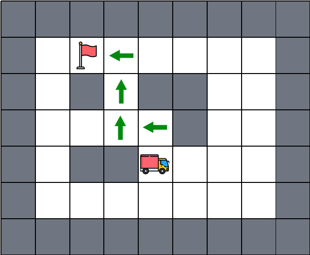
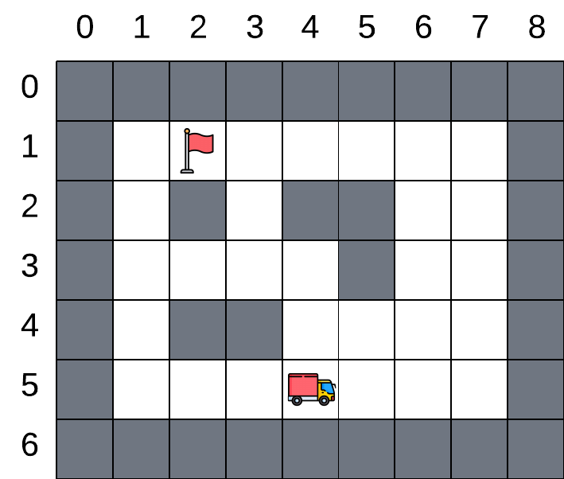
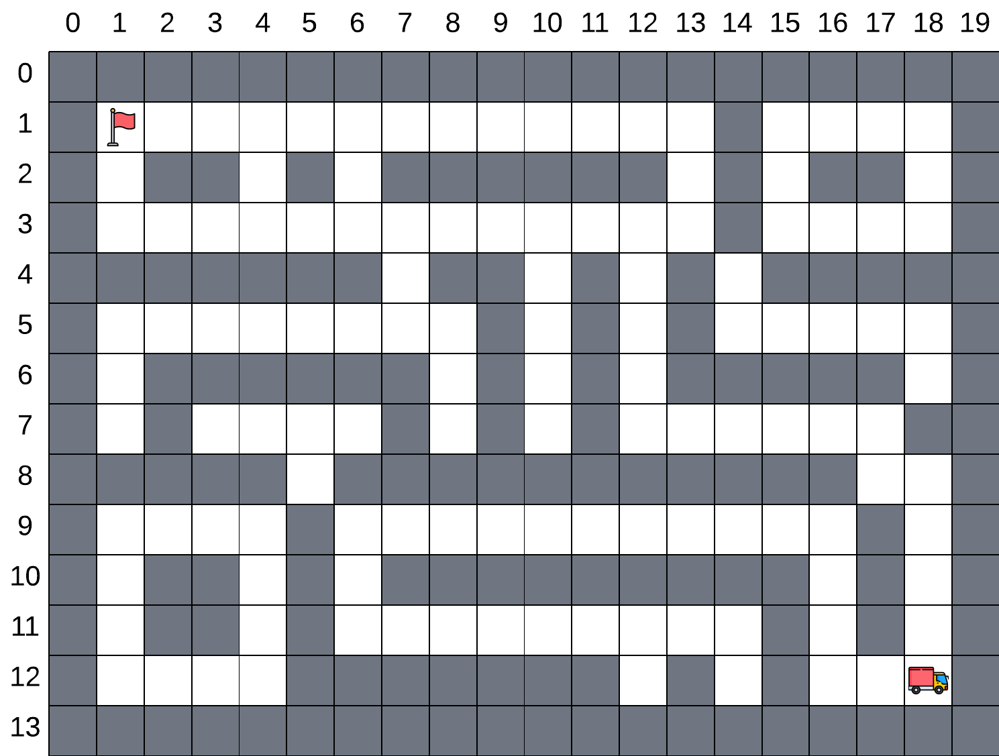
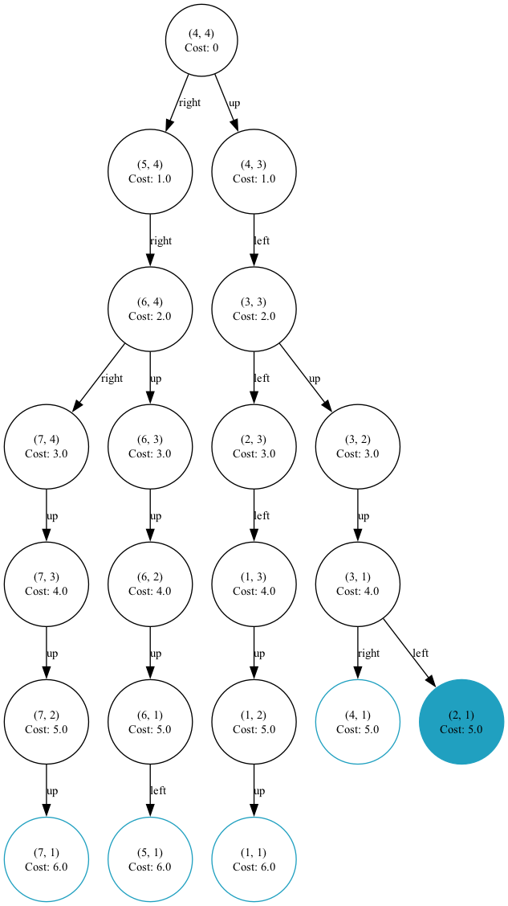
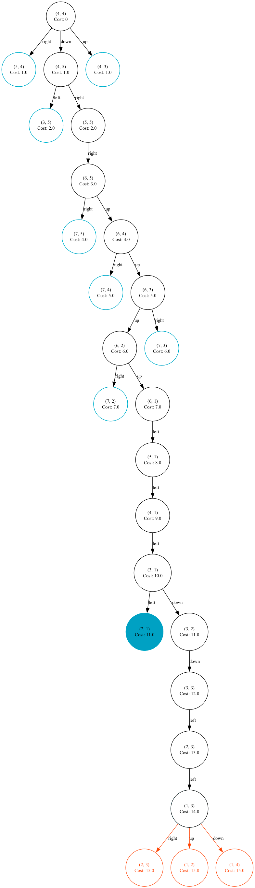
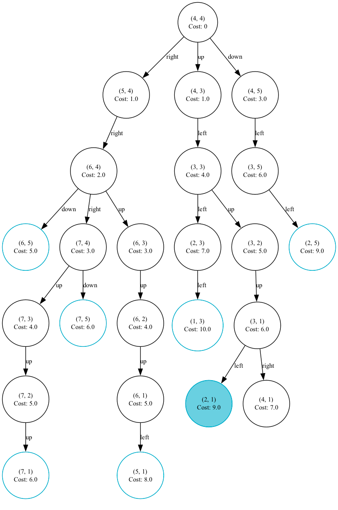
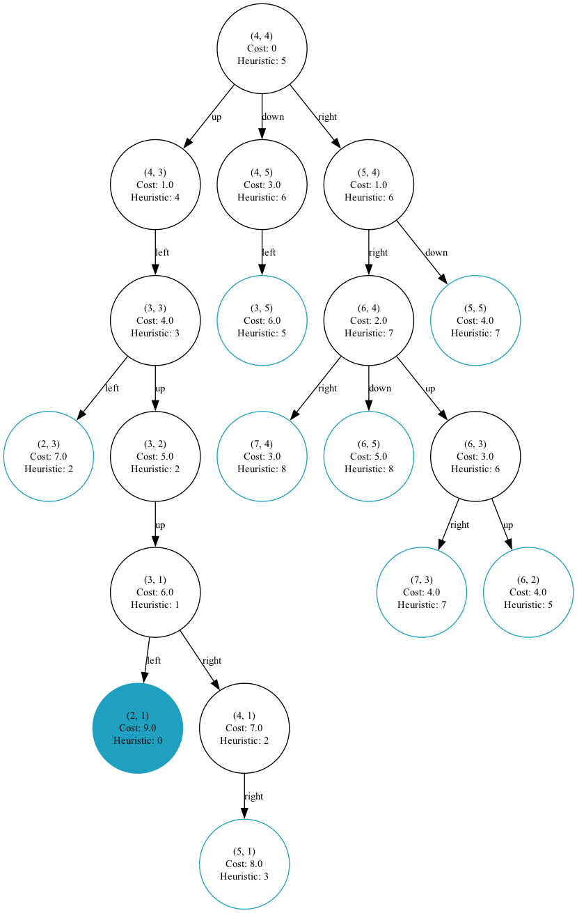
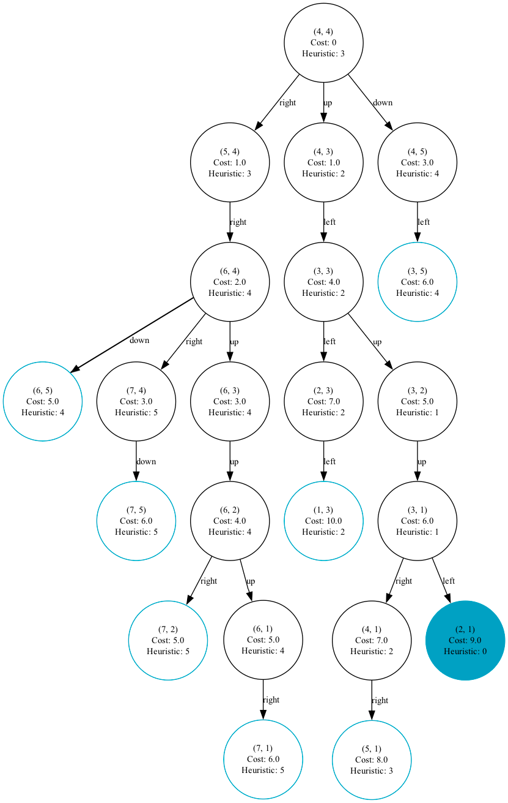
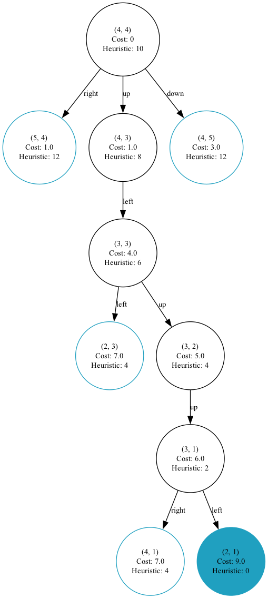

Búsqueda de rutas en empresa de paquetería

<strong>CÓDIGO</strong>

  	
  	
  	

## 1. Introducción 

En esta actividad se explora el comportamiento de distintos algoritmos de búsqueda sobre entornos discretos representados mediante matrices. El objetivo es evaluar la capacidad de cada algoritmo para encontrar soluciones óptimas y estudiar su eficiencia bajo diferentes condiciones, considerando factores como los costes asociados a las acciones, la estructura del entorno y la función heurística utilizada.

El trabajo se ha desarrollado con un enfoque experimental, realizando múltiples pruebas controladas con distintas configuraciones. A lo largo de la actividad se definen formalmente los componentes del problema de búsqueda, incluyendo los estados, las acciones disponibles, la función de transición, el cálculo de costes y la condición de objetivo. Además, se incorporan funciones heurísticas que permiten aplicar algoritmos informados como A*, lo que amplía el análisis hacia entornos más realistas y complejos.

El entorno de simulación se representa mediante mapas en formato ASCII, sobre los que se ejecutan los algoritmos seleccionados en cada caso. Cada sección del trabajo está estructurada en torno a un caso experimental específico, que permite observar el comportamiento de las estrategias planteadas bajo distintas condiciones. Los resultados se documentan mediante visualizaciones y tablas comparativas, acompañadas de un análisis crítico que contrasta la teoría con la práctica. Este enfoque permite comprender no solo el funcionamiento interno de cada algoritmo, sino también las consecuencias de sus decisiones en términos de coste, tiempo y uso de memoria.

 

## 2. Comparación de algoritmos BFS y DFS 

En esta sección se presentarán los resultados obtenidos al comparar los algoritmos de búsqueda en amplitud (BFS) y búsqueda en profundidad (DFS) bajo un escenario con costes de movimiento uniformes. El experimento se corresponde con la cuarta parte del código proporcionado, donde se ejecutan ambos algoritmos sobre un mismo mapa base. El objetivo es evaluar su comportamiento en términos de optimalidad, completitud y eficiencia, analizando aspectos como la longitud de la solución encontrada, su coste, el número de nodos expandidos y el tamaño máximo alcanzado por la lista de nodos en espera durante la búsqueda.

 

### 2.1. Resultados y discusión

*Tabla 1. Comparativa de resultados de los algoritmos de búsqueda en amplitud (BFS) y búsqueda en profundidad (DFS).*

  <table border="1" cellpadding="5" cellspacing="0" style="border-collapse: collapse;">
    <tr style="background-color: #0098CD; color:white; text-align: center;">
      <th>Algoritmo</th>
      <th>Solución</th>
      <th>Longitud</th>
      <th>Coste</th>
      <th>Tam. Máx. Lista</th>
      <th>Nodos Expandidos</th>
    </tr>
    <!-- BFS -->
    <tr style="background-color:white" align="center">
      <td><strong>BFS</strong></td>
      <td>
        <table cellpadding="3" cellspacing="0" style="border-collapse: collapse; font-size:12px;">
          <tr style="background-color: #BDD6EE;" align="center"><td>1</td><td>start</td><td>(4,4)</td></tr>
          <tr align="center"><td>2</td><td>up</td><td>(4,3)</td></tr>
          <tr align="center"><td>3</td><td>left</td><td>(3,3)</td></tr>
          <tr align="center"><td>4</td><td>up</td><td>(3,2)</td></tr>
          <tr align="center"><td>5</td><td>up</td><td>(3,1)</td></tr>
          <tr style="background-color: #C5E0B3;" align="center"><td>6</td><td>left</td><td>(2,1)</td></tr>
        </table>
      </td>
      <td>6</td>
      <td>5.0</td>
      <td>7</td>
      <td>25</td>
    </tr>
    <!-- DFS -->
    <tr style="background-color:white" align="center">
      <td><strong>DFS</strong></td>
      <td>
        <table cellpadding="3" cellspacing="0" style="border-collapse: collapse; font-size:12px;">
          <tr style="background-color: #BDD6EE;" align="center"><td>1</td><td>start</td><td>(4,4)</td></tr>
          <tr align="center"><td>2</td><td>down</td><td>(4,5)</td></tr>
          <tr align="center"><td>3</td><td>right</td><td>(5,5)</td></tr>
          <tr align="center"><td>4</td><td>right</td><td>(6,5)</td></tr>
          <tr align="center"><td>5</td><td>up</td><td>(6,4)</td></tr>
          <tr align="center"><td>6</td><td>up</td><td>(6,3)</td></tr>
          <tr align="center"><td>7</td><td>up</td><td>(6,2)</td></tr>
          <tr align="center"><td>8</td><td>up</td><td>(6,1)</td></tr>
          <tr align="center"><td>9</td><td>left</td><td>(5,1)</td></tr>
          <tr align="center"><td>10</td><td>left</td><td>(4,1)</td></tr>
          <tr align="center"><td>11</td><td>left</td><td>(3,1)</td></tr>
          <tr style="background-color: #C5E0B3;" align="center"><td>12</td><td>left</td><td>(2,1)</td></tr>
        </table>
      </td>
      <td>12</td>
      <td>11.0</td>
      <td>10</td>
      <td>22</td>
    </tr>
  </table>

<table>
  <tr style="background-color: white">
    <td style="border: hidden;">
      

 
    </td>
    <td style="border: hidden;">
      

 
    </td>    
  </tr>
  <tr style="background-color: white">
    <td style="border: hidden;">
      
<i>Figura 1 - Solución encontrada por BFS</i>

    </td>
    <td style="border: hidden;">
      
<i>Figura 2 - Solución encontrada por DFS</i>

    </td>
  </tr>
</table>

En el caso analizado, la búsqueda en amplitud ha encontrado una solución de menor coste y menor longitud, lo que demuestra que, bajo estas condiciones, se comporta como un algoritmo óptimo. Esto se explica porque todos los movimientos tienen el mismo coste, y la búsqueda en amplitud explora los nodos por niveles, garantizando así que la primera solución encontrada sea la de menor número de pasos, que en este escenario coincide con la de menor coste.

Por el contrario, la búsqueda en profundidad ha obtenido una solución más larga y costosa. Aunque también ha encontrado una solución válida, ya que es un algoritmo completo, no garantiza que esta sea óptima. Esto se debe a su estrategia de exploración, que prioriza caminos profundos sin considerar el coste acumulado ni la cercanía al objetivo, lo que puede llevar a recorridos poco eficientes, como se ha observado en este caso.

En cuanto a la eficiencia, los datos muestran que BFS ha sido más eficaz en cuanto a complejidad espacial en este caso concreto. Aunque teóricamente DFS suele requerir menos memoria, ya que su complejidad espacial es                                 , aquí se observa que el tamaño máximo de la lista en DFS ha sido ligeramente mayor que en BFS. Esta diferencia se debe al recorrido específico que ha seguido DFS, al profundizar en ramas largas que no conducían directamente al objetivo, ha llegado a acumular más nodos antes de retroceder.

Respecto a la complejidad temporal, DFS ha sido algo más eficiente, ya que ha necesitado menos iteraciones para encontrar una solución. No obstante, conviene recordar que ambos algoritmos son poco eficientes en tiempo. DFS puede volverse muy costoso si el árbol es profundo, mientras que el tiempo de BFS crece exponencialmente con la profundidad del objetivo.

En este caso particular, DFS ha ofrecido una ligera ventaja en tiempo, mientras que BFS ha sido más eficiente en espacio y, además, ha devuelto una solución óptima, lo cual es una ventaja cuando se requiere minimizar el número de pasos. Por tanto, en este escenario concreto, **BFS sería la opción más recomendable** **en este escenario**, **siempre que el coste de tiempo sea asumible**.

## 3. Comparación de algoritmos BFS, UCS y $\text{A}^*$ con costes variables

En esta sección se analizarán las diferencias de comportamiento entre los algoritmos de búsqueda en amplitud, Dijkstra (UCS) y $\text{A}^*$, en un entorno donde los movimientos tienen costes diferenciados. A diferencia del caso anterior, donde todos los desplazamientos costaban lo mismo, en este escenario se penalizan los movimientos hacia la izquierda y hacia abajo, lo que permite evaluar cómo cada algoritmo gestiona trayectorias con acciones de coste desigual. Además, en el caso de $\text{A}^*$, se ha aplicado una heurística basada en la distancia de Manhattan.

 

### 3.1. Resultados y discusión

*Tabla 2. Comparativa de los algoritmos de búsqueda en amplitud (BFS), búsqueda de coste uniforme (UCS) y A\**

  <table border="1" cellpadding="5" cellspacing="0" style="border-collapse: collapse;">
    <tr style="background-color: #0098CD; color:white; text-align: center;">
      <th>Algoritmo</th>
      <th>Solución</th>
      <th>Longitud</th>
      <th>Coste</th>
      <th>Tam. Máx. Lista</th>
      <th>Nodos Expandidos</th>
    </tr>
    <!-- BFS -->
    <tr style="background-color:white" align="center">
      <td><strong>BFS</strong></td>
      <td rowspan="3">
        <table cellpadding="3" cellspacing="0" style="border-collapse: collapse; font-size:12px;">
          <tr style="background-color: #BDD6EE;" align="center"><td>1</td><td>start</td><td>(4,4)</td></tr>
          <tr align="center"><td>2</td><td>up</td><td>(4,3)</td></tr>
          <tr align="center"><td>3</td><td>left</td><td>(3,3)</td></tr>
          <tr align="center"><td>4</td><td>up</td><td>(3,2)</td></tr>
          <tr align="center"><td>5</td><td>up</td><td>(3,1)</td></tr>
          <tr style="background-color: #C5E0B3;" align="center"><td>6</td><td>left</td><td>(2,1)</td></tr>
        </table>
      </td>
      <td>6</td>
      <td>9.0</td>
      <td>7</td>
      <td>25</td>
    </tr>
    <!-- UCS / Dijkstra -->
    <tr style="background-color:white" align="center">
      <td><strong>UCS (Dijkstra)</strong></td>
      <td>6</td>
      <td>9.0</td>
      <td>7</td>
      <td>23</td>
    </tr>
    <!-- A* -->
    <tr style="background-color:white" align="center">
      <td><strong>A*</strong></td>
      <td>6</td>
      <td>9.0</td>
      <td>9</td>
      <td>11</td>
    </tr>
  </table>

<table>
  <tr style="background-color: white">
    <td style="border: hidden;">
      

 
    </td>
    <td style="border: hidden;">
      

 
    </td> 
    <td style="border: hidden;">
      

 
    </td> 
  </tr>
  <tr style="background-color: white">
    <td style="border: hidden;">
      
<i>Figura 1 - Solución encontrada por BFS</i>

    </td>
    <td style="border: hidden;">
      
<i>Figura 3 - Solución encontrada por UCS</i>

    </td>
    <td style="border: hidden;">
      
<i>Figura 4 - Solución encontrada por A*</i>

    </td>
  </tr>
</table>

En cuanto a la calidad de las soluciones obtenidas, tanto UCS como $\text{A}^*$ han encontrado un camino con coste total de 9.0, lo que confirma que ambos algoritmos han devuelto soluciones óptimas en este entorno. UCS, también conocido como Dijkstra, garantiza la optimalidad siempre que los costes de las acciones sean positivos. Su funcionamiento se basa en expandir de forma prioritaria los nodos con menor coste acumulado, por lo que, en ausencia de ciclos negativos, encuentra siempre el camino de coste mínimo.

Por su parte, $\text{A}^*$ ha empleado una heurística basada en la distancia de Manhattan, que en este caso resulta admisible porque no sobreestima el coste real hasta el objetivo, y además es consistente, ya que cumple que la función del nodo hijo no es inferior a la del nodo padre. Estas propiedades teóricas permiten asegurar que $\text{A}^*$ devolverá soluciones óptimas cuando se utilicen costes positivos, como sucede en este experimento.

Un hecho llamativo es que la búsqueda en amplitud (BFS) también ha devuelto una solución con coste 9.0, a pesar de no tener en cuenta los costes diferenciados de las acciones. Sin embargo, esta coincidencia no debe interpretarse como una prueba de su optimalidad en entornos con penalizaciones. Se trata de una consecuencia de la estructura del mapa, que obliga al agente a recorrer un número fijo de casillas en cada dirección para alcanzar la meta. Dado que únicamente se permiten movimientos ortogonales, el camino más corto en número de pasos termina coincidiendo con el de menor coste, incluso si algunas acciones están penalizadas. En otros escenarios, especialmente aquellos que incluyan movimientos diagonales o trayectorias más flexibles, BFS dejaría de ser capaz de encontrar soluciones óptimas, a diferencia de UCS y $\text{A}^*$.

Desde el punto de vista de la eficiencia, $\text{A}^*$ ha mostrado una ventaja clara en términos de tiempo, ya que ha visitado menos de la mitad de nodos que UCS. Esta diferencia se explica por la capacidad de la heurística para orientar la búsqueda hacia el objetivo, evitando la expansión de nodos irrelevantes. UCS, en cambio, ha requerido más iteraciones al no disponer de una guía adicional más allá del coste acumulado. No obstante, ha resultado ligeramente más eficiente en el uso de memoria, lo cual puede ser relevante en sistemas con recursos limitados. En un contexto práctico como el reparto de paquetería, donde el tiempo de respuesta tiene un peso importante, $\text{A}^*$ sería la opción más eficiente. Si el tiempo de ejecución no fuera una limitación relevante, UCS seguiría siendo una opción válida gracias a su menor consumo de memoria o en situaciones en las que no se disponga de una heurística adecuada.

Puede afirmarse, por tanto, que tanto UCS como $\text{A}^*$ seguirán proporcionando soluciones óptimas aunque se modifique la estructura del mapa o se ajusten los costes de las acciones, siempre que se respeten las condiciones teóricas propias de cada algoritmo. En el caso de UCS, basta con que los costes sean positivos o nulos. En el caso de A*, la heurística debe ser admisible y, si se trabaja con grafos, también consistente. Esta afirmación ha sido confirmada mediante pruebas adicionales con mapas más complejos, en los que ambos algoritmos han mantenido su comportamiento óptimo.

Ahora bien, en otro tipo de problemas más generales, en los que pudiera haber acciones con coste negativo, estas garantías dejan de aplicarse. Por ejemplo, en modelos de planificación energética, donde algunas tareas reducen el coste acumulado, como mecanismos de enfriamiento o recuperación de energía, pueden aparecer costes negativos que invalidan la optimalidad de UCS y $\text{A}^*$. En estos casos se emplean algoritmos distintos, diseñados específicamente para operar bajo esas condiciones.

Como curiosidad teórica, se ha introducido un experimento adicional descrito en la sección 5.1 del código, en el que una de las acciones tiene un coste negativo. A pesar de ello, los resultados no se han visto afectados. Esto se debe a que el entorno está acotado, no se permite repetir nodos y la estructura del mapa limita las trayectorias posibles. Bajo estas condiciones concretas, tanto UCS como $\text{A}^*$ siguen devolviendo la solución óptima incluso con un coste negativo. Sin embargo, este comportamiento no es extrapolable y no tendría sentido práctico aplicar costes negativos en problemas logísticos como el que nos ocupa.

## 4. Comparación de funciones heurísticas en $\text{A}^*$

Al igual que en la sección anterior, en esta sección se analiza el comportamiento de distintos algoritmos frente a un nuevo enfoque. En concreto, se ejecuta el **Caso 3**, centrado en comparar el rendimiento del algoritmo **$\textbf{A}^\boldsymbol{*}$** al utilizar tres funciones heurísticas diferentes. Además, se toma como referencia el resultado obtenido por **UCS (Dijkstra)** para valorar la optimalidad de las soluciones encontradas. Para ello, se repite la ejecución del algoritmo $\text{A}^*$ variando únicamente la heurística empleada. Las tres funciones utilizadas son:

- **heuristic1 – Distancia de Manhattan:** `return abs(x - gx) + abs(y - gy)`

  Calcula la suma de las diferencias absolutas entre las coordenadas actuales y las del objetivo. Es admisible y consistente en entornos sin diagonales ni costes negativos.

- **heuristic2 – Distancia de Chebyshev (sin diagonales):** `return max(abs(x - gx), abs(y - gy))`

  Representa el número mínimo de movimientos si fueran posibles todas las direcciones (incluidas diagonales). Aunque el entorno no lo permite, sigue siendo admisible, aunque menos precisa en cuadrículas ortogonales.

- **heuristic3 – Distancia de Manhattan multiplicada x 2:** `return 2*(abs(x - gx) + abs(y - gy))`

  Es una versión "inflada" de la Manhattan. No es admisible, ya que sobreestima el coste real y rompe la garantía teórica de optimalidad de $\text{A}^*$, aunque puede acelerar la búsqueda si el entorno lo permite.

### 4.1. Resultados y discusión

*Tabla 3. Comparativa de los algoritmos de búsqueda de coste uniforme (UCF) y A* con diferentes heurísticas*

  <table border="1" cellpadding="5" cellspacing="0" style="border-collapse: collapse;">
    <tr style="background-color: #0098CD; color:white; text-align: center;">
      <th>Algoritmo</th>
      <th>Solución</th>
      <th>Longitud</th>
      <th>Coste</th>
      <th>Tam. Máx. Lista</th>
      <th>Nodos Expandidos</th>
    </tr>
    <!-- UCS / DIJKSTRA -->
    <tr style="background-color:white" align="center">
      <td><strong>UCS</strong> (Dijkstra)</td>
      <!-- SOLUCIÓN COMPARTIDA -->
      <td rowspan="4">
        <table cellpadding="3" cellspacing="0" style="border-collapse: collapse; font-size:12px;">
          <tr style="background-color: #BDD6EE;" align="center"><td>1</td><td>start</td><td>(4,4)</td></tr>
          <tr align="center"><td>2</td><td>up</td><td>(4,3)</td></tr>
          <tr align="center"><td>3</td><td>left</td><td>(3,3)</td></tr>
          <tr align="center"><td>4</td><td>up</td><td>(3,2)</td></tr>
          <tr align="center"><td>5</td><td>up</td><td>(3,1)</td></tr>
          <tr style="background-color: #C5E0B3;" align="center"><td>6</td><td>left</td><td>(2,1)</td></tr>
        </table>
      </td>
      <td>6</td>
      <td>9.0</td>
      <td>7</td>
      <td>23</td>
    </tr>
    <!-- A* MANHATTAN -->
    <tr style="background-color:white" align="center">
      <td><strong>A*</strong> Distancia Manhattan</td>
      <td>6</td>
      <td>9.0</td>
      <td>9</td>
      <td>11</td>
    </tr>
    <!-- A* CHEBYSHEV -->
    <tr style="background-color:white" align="center">
      <td><strong>A*</strong> Distancia Chebyshev</td>
      <td>6</td>
      <td>9.0</td>
      <td>9</td>
      <td>18</td>
    </tr>
    <!-- A* MANHATTAN x2 -->
    <tr style="background-color:white" align="center">
      <td><strong>A*</strong> Distancia Manhattan (x2)</td>
      <td>6</td>
      <td>9.0</td>
      <td>5</td>
      <td>6</td>
    </tr>
  </table>

<table>
  <tr style="background-color: white">
    <td style="border: hidden;">
      

 
    </td>
    <td style="border: hidden;">
      

 
    </td> 
    <td style="border: hidden;">
      

 
    </td> 
  </tr>
  <tr style="background-color: white">
    <td style="border: hidden;">
      
<i>Figura 5 - Solución encontrada por A* (Heurística - distancia Manhattan)</i>

    </td>
    <td style="border: hidden;">
      
<i>Figura 6 - Solución encontrada por A* (Heurística - distancia Chebyshev)</i>

    </td>
    <td style="border: hidden;">
      
<i>Figura 7 - Solución encontrada por A* (Heurística - distancia Manhattan x 2)</i>

    </td>
  </tr>
</table>

Los resultados muestran que tanto UCS como $\text{A}^*$ han encontrado caminos con un coste total de 9.0, lo que confirma que ambos algoritmos han proporcionado soluciones óptimas en este entorno. En el caso de UCS, este comportamiento era esperable, ya que su diseño garantiza la optimalidad siempre que los costes sean positivos. El algoritmo expande los nodos en orden creciente de coste acumulado, lo que le permite identificar el camino de menor coste siempre que no existan ciclos negativos.

$\text{A}^*$ también ha logrado la solución óptima en las tres ejecuciones, a pesar de utilizar heurísticas diferentes. En los casos de la heurística basada en la distancia de Manhattan y de la distancia de Chebyshev, ambas son admisibles y consistentes, por lo que ofrecen garantías teóricas de optimalidad. Más relevante es el resultado obtenido con la heurística de Manhattan multiplicada por dos, que no cumple la condición de admisibilidad porque sobreestima el coste real restante. Sin embargo, en este entorno concreto también ha conducido a la solución óptima. Esto se debe a que la sobreestimación no ha sido lo suficientemente elevada como para desviar la búsqueda hacia caminos subóptimos.

Para comprobar los efectos de una sobreestimación más pronunciada, se ha introducido un experimento adicional en el que se emplea una heurística basada en la distancia de Manhattan multiplicada por cuatro. En este caso sí se ha observado una pérdida de optimalidad, ya que el algoritmo $\text{A}^*$ ha seleccionado un camino con un coste mayor que el mínimo. Este resultado confirma que, aunque una heurística ligeramente agresiva puede no afectar al resultado final en entornos acotados, un exceso en el valor estimado puede comprometer la calidad de la solución. Esta prueba se documenta en la [sección 6.3 del bloque de código adjunto](code/Búsqueda_de_rutas_en_empresa_de_paquetería.ipynb).

En cuanto a la eficiencia, las diferencias entre heurísticas han sido más significativas. La heurística 3 (Manhattan por dos) ha resultado ser la más eficiente, tanto en tiempo como en memoria, al reducir considerablemente el número de nodos explorados. Esto se debe a que la función $f(n)$, al dar más peso a la heurística, guía la búsqueda de forma más agresiva hacia el objetivo. La heurística de Manhattan, aunque algo menos eficiente, ha ofrecido un buen equilibrio entre rendimiento y garantía de optimalidad. Por el contrario, la heurística de Chebyshev ha mostrado el peor rendimiento computacional, probablemente porque su aproximación no se ajusta bien a la geometría del entorno ni al sistema de penalizaciones utilizado en los movimientos.

Para analizar si este comportamiento se mantiene en entornos modificados, se han realizado tres pruebas adicionales. En la primera se ha cambiado la posición de inicio del agente manteniendo el resto del entorno ([Figura 8](#Figura_8)), en la segunda se ha utilizado un mapa de mayor tamaño y complejidad ([Figura 9](#Figura_9)), con múltiples rutas posibles y en la tercera se modificaron los costes de las acciones (*ver la sección 6.1 del bloque de código adjunto*). En las dos primeras pruebas, todas las heurísticas condujeron a la misma solución óptima, aunque las diferencias de eficiencia se acentuaron en el segundo experimento. En el mapa de la [Figura 9](#Figura_9), la heurística de Manhattan multiplicada por dos volvió a ser la más eficiente, seguida por la heurística de Manhattan simple y, por último, la de Chebyshev, que expandió el mayor número de nodos 

 

<table>
  <tr style="background-color: white">
    <td width="50%" style="border: hidden;">
      

 
    </td>
    <td width="50%" style="border: hidden;">
      

 
    </td>    
  </tr>
  <tr style="background-color: white">
    <td style="border: hidden;">
      
<i>Figura 8 - Mapa original modificando la posición de salida</i>

    </td>
    <td style="border: hidden;">
      
<i>Figura 9 - Nueva variación del mapa</i>

    </td>
  </tr>
</table>

No obstante, aunque las tres heurísticas han mantenido la optimalidad en estos casos, solo las dos primeras ofrecen garantías teóricas. La heurística de Manhattan por dos no es admisible, por lo que en entornos más complejos o con penalizaciones distintas podría inducir a errores. De hecho, al modificar los costes, se ha conseguido inducir pérdida de optimalidad, ya que la heurística inflada llevó al algoritmo $\text{A}^*$ a seleccionar un camino con mayor coste. Esto confirma que su comportamiento no es robusto frente a penalizaciones más severas. En cambio, únicamente modificando paredes o posiciones no se ha logrado construir un mapa que evidencie esta pérdida, lo que sugiere que, dentro de los límites del entorno evaluado, esta heurística puede seguir funcionando correctamente aunque no ofrezca garantías formales.

TABLAS AQUI

[Figura 13. Código manejador de logs. Fuente: Elaboración propia.](#Figura_13)

## 5. Conclusiones

Tras la ejecución de múltiples experimentos con diferentes algoritmos de búsqueda sobre entornos discretos representados como matrices, se ha podido evaluar su capacidad para encontrar soluciones óptimas y su eficiencia en distintos contextos. Los resultados confirman que UCS (Dijkstra) y $\text{A}^*$ ofrecen soluciones óptimas de forma consistente siempre que se respeten sus condiciones teóricas: costes positivos para UCS y heurísticas admisibles (y consistentes en búsqueda sobre grafos) para $\text{A}^*$. En este trabajo se ha verificado dicha optimalidad en todos los casos evaluados, tanto con mapas simples como con mapas más complejos y configuraciones alternativas.

En el caso de BFS, aunque en algunos escenarios ha devuelto caminos óptimos, esto ha sido consecuencia de restricciones estructurales del entorno (como el número fijo de pasos en cada dirección), y no de su capacidad para considerar costes diferenciados. Por tanto, no puede considerarse un algoritmo fiable para problemas con penalizaciones o trayectorias flexibles. DFS, por su parte, ha demostrado ser completo pero no óptimo, encontrando soluciones válidas pero más costosas y, en ocasiones, con mayor longitud. A nivel de eficiencia, DFS ha sido más rápido, mientras que BFS ha mostrado mejor comportamiento espacial en este entorno concreto.

$\text{A}^*$ ha destacado tanto por su exactitud como por su eficiencia. En particular, se ha comprobado que el uso de heurísticas admisibles (como Manhattan o Chebyshev) garantiza la optimalidad de $\text{A}^*$, mientras que una heurística no admisible (Manhattan × 2) también ha producido resultados óptimos en todos los escenarios evaluados. Esto ha sido posible gracias a la estructura acotada del entorno y a la ausencia de caminos alternativos competitivos, lo que impide que la sobreestimación heurística llegue a penalizar las rutas correctas. En otras palabras, el propio diseño cerrado del entorno restringe tanto las trayectorias posibles que los caminos subóptimos ni siquiera pueden ser explorados, lo que explica el buen comportamiento de una heurística que, en teoría, podría inducir errores.

Ahora bien, se ha demostrado también que una heurística más agresiva (Manhattan × 4) sí puede inducir pérdida de optimalidad, desviando al algoritmo hacia caminos subóptimos. Este hallazgo confirma que, aunque una heurística no admisible puede mejorar el rendimiento en entornos cerrados, su uso no es generalizable y debe ser evaluado con cautela.

En cuanto al rendimiento computacional, las diferencias entre heurísticas han sido significativas. La heurística inflada (Manhattan × 2) ha resultado la más eficiente tanto en tiempo como en número de nodos explorados, seguida por Manhattan simple, mientras que Chebyshev ha sido la menos eficiente. Estos patrones se han mantenido en mapas modificados, incluso con mayor complejidad estructural, lo que refuerza la validez de las observaciones.

Los resultados de este trabajo han sido consistentes con la teoría y demuestran la importancia de seleccionar adecuadamente el algoritmo y la heurística en función del entorno. En problemas como el de reparto de paquetería, donde el tiempo de respuesta y la fiabilidad del camino son factores clave, $\text{A}^*$ con una heurística bien calibrada representa una opción altamente eficaz. No obstante, debe recordarse que estos resultados están condicionados por las características del entorno. En escenarios con movimientos diagonales, costes negativos u obstáculos dinámicos, el comportamiento de los algoritmos podría variar significativamente y sería necesario reevaluar su idoneidad.

## Anexo A. Árbol generado por BFS

## Anexo B. Árbol generado por DFS

## Anexo C. Árbol generado por UCS (Dijkstra)

## Anexo D. Árbol generado por $\text{A}^*$ (h(n) = Distancia Manhattan)

## Anexo E. Árbol generado por $\text{A}^*$ (h(n) = Distancia Chebyshev)

## Anexo F. Árbol generado por $\text{A}^*$ (h(n) = Distancia Manhattan x2)

