
Planificación de un Rover marciano

<strong>CÓDIGO</strong>

  

## 1. Introducción 

La planificación automatizada ofrece un marco formal para modelar entornos dinámicos, especificar objetivos y generar secuencias de acciones capaces de conducir a un agente desde un estado inicial hasta la consecución de una meta. Este trabajo se sitúa en ese contexto y aborda de manera integral el proceso de diseño, análisis y evaluación de un sistema basado en PDDL, incorporando tanto aspectos de modelado como consideraciones experimentales. A lo largo del estudio se exploran las distintas fases que conforman el ciclo completo de desarrollo en planificación: desde la configuración del entorno de trabajo y la comprensión operativa de las acciones disponibles, hasta la modificación progresiva del problema y del dominio para introducir nuevas capacidades, restricciones y dinámicas. Este proceso permite observar cómo evoluciona el comportamiento de los planificadores ante cambios estructurales y cómo se ve influida la generación de soluciones al alterar la naturaleza del espacio de estados.

El análisis experimental realizado proporciona una perspectiva comparada sobre diferentes algoritmos de planificación, poniendo de relieve las estrategias que emplean para explorar el espacio de búsqueda, su eficiencia en términos computacionales y su capacidad para adaptarse a escenarios de creciente complejidad. La inclusión de nuevas entidades, interacciones y condiciones adicionales permite evaluar no solo la corrección del modelado, sino también la robustez de los planificadores frente a configuraciones más realistas y exigentes. El trabajo, en su conjunto, ofrece así una visión amplia y articulada del diseño y evaluación de sistemas de planificación, mostrando cómo la combinación de modelado riguroso y análisis empírico contribuye a comprender mejor las posibilidades y limitaciones de estas técnicas dentro del ámbito de la inteligencia artificial.

 

## 2. Instalación y análisis del entorno de desarrollo 

El desarrollo de tareas de planificación automatizada requiere disponer de un entorno adecuado que facilite tanto la edición de los modelos como su validación y experimentación. En este bloque se presenta el proceso de preparación y exploración del entorno utilizado para trabajar con PDDL, analizando los elementos esenciales que permiten definir dominios, estudiar el comportamiento de las acciones y ejecutar distintos planificadores sobre un mismo problema. A través de este análisis se obtiene una visión estructurada del flujo de trabajo empleado, desde la configuración inicial hasta la interpretación de los resultados generados por los algoritmos de planificación, proporcionando así una base sólida para el estudio y la evaluación posterior de sus diferencias y capacidades.

 

### 2.1. Entorno de desarrollo utilizado

Para esta actividad se ha utilizado **Visual Studio Code** con la extensión *PDDL*, que permite editar, validar y ejecutar dominios y problemas directamente desde el editor, además de integrar servicios de planificación remota a través de la plataforma [planning.domains](https://planning.domains). La [Figura 1](#Figura_1) muestra la vista inicial del editor tras su instalación. En la [Figura 2](#Figura_2) se observa la configuración del servicio de planificación, que permite seleccionar el planificador deseado y enviar directamente los archivos **`.pddl`** al servidor remoto. Por último, la [Figura 3](#Figura_3) muestra la extensión instalada, que proporciona resaltado sintáctico, validación, ejecución y visualización del plan.

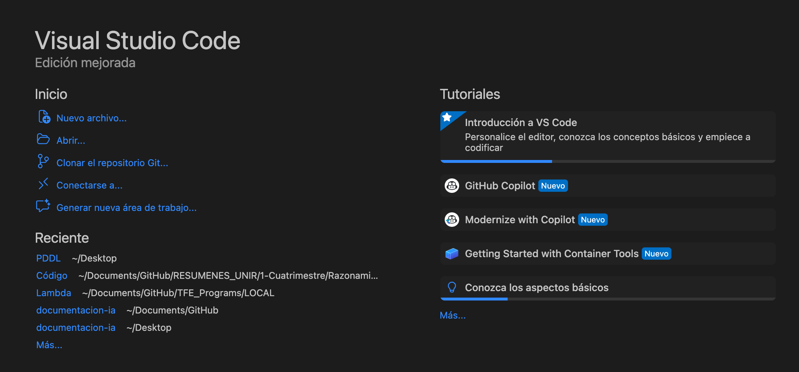

<i>Figura 1 - Vista inicial del entorno Visual Studio Code tras la instalación</i>

<i>Figura 2 - Configuración de la extensión PDDL con el planificador remoto</i>

<i>Figura 3 - Extensión PDDL instalada en Visual Studio Code</i>

### 2.2. Acciones ejecutables en el primer paso (encadenamiento hacia delante)

En esta sección se identifican las acciones instanciadas que podrían ejecutarse directamente desde el estado inicial del problema, siguiendo un enfoque de encadenamiento hacia delante. Para ello, se han revisado las precondiciones de cada acción definida en el dominio con el objetivo de determinar cuáles son aplicables en el primer paso del plan.

Tras dicho análisis, se identifican como ejecutables en el estado inicial las siguientes acciones:

- **Acción `navigate-bat`**
  - `navigate-bat (rover0 waypoint3 waypoint0 bat0 b4 b4 b3)`
  - `navigate-bat (rover0 waypoint3 waypoint1 bat0 b4 b4 b3)`
- **Acción `sample_soil`**
  - `sample_soil (rover0 rover0store waypoint3)`
- **Acción `sample_rock`**
  - `sample_rock (rover0 rover0store waypoint3)`

Una vez identificadas las acciones directamente ejecutables, conviene distinguir dos situaciones diferentes entre aquellas que no pueden ejecutarse en el primer paso, ya que no todas fallan por el mismo motivo.

Por un lado, existen **acciones potencialmente ejecutables pero bloqueadas por el estado inicial**. Se trata de acciones correctamente definidas en el dominio, cuyas precondiciones son coherentes, pero que no se cumplen debido a la configuración concreta del entorno en el estado inicial. En este grupo se encuentran:

- La acción **`recharge`** requiere que el rover y el lander se encuentren en el mismo `waypoint`, condición que no se satisface inicialmente al estar el rover en `waypoint3` y el lander en `waypoint0`.
- La acción **`calibrate`** exige que el objetivo sea visible desde la posición actual del rover, lo que no ocurre inicialmente para `objective1` desde `waypoint3`.

Por otro lado, existen **acciones que no son ejecutables sin pasos previos**, ya que dependen de efectos que solo pueden alcanzarse tras la ejecución de otras acciones. En este grupo se incluyen:

- **`take_image`**, que requiere que la cámara esté previamente calibrada.
- **`drop`**, que solo puede ejecutarse cuando el almacén está lleno.
- Las acciones de comunicación (**`communicate_soil_data`**, **`communicate_rock_data`** y **`communicate_image_data`**), que dependen de que el rover disponga previamente de datos obtenidos mediante análisis o captura de imágenes.

### 2.3. Acciones consideradas desde el objetivo (encadenamiento hacia atrás)

En esta sección se analizan las acciones que podrían conducir a alcanzar los objetivos definidos en la meta, aplicando un esquema de encadenamiento hacia atrás. Para ello, se identifican aquellas acciones del dominio que producen como efecto directo alguno de los literales presentes en el objetivo. A partir de ello, se realiza una instanciación parcial de dichas acciones, fijando los parámetros comprometidos por el objetivo y estimando el total de combinaciones posibles que podrían formar parte de un plan orientado a alcanzarlo.

- **Acción `communicate_soil_data`**

  - **Efecto deseado:** `(communicated_soil_data waypoint2)`

  - **Parámetros fijos:**  `?p = waypoint2`

  - **Combinaciones posibles instanciando con los objetos disponibles:**

    `rover0` (1) × `general` (1) × `waypoint2` (1) × `?x` (4) × `?y` (4) = 16

- **Acción `communicate_rock_data`**

  - **Efecto deseado:** `(communicated_rock_data waypoint3)`

  - **Parámetros fijos:** `?p = waypoint3`

  - **Combinaciones posibles instanciando con los objetos disponibles:**

    `rover0` (1) × `general` (1) × `waypoint2` (1) × `?x` (4) × `?y` (4) = 16

- **Acción `communicate_image_data`**

  - **Efecto deseado:** `(communicated_image_data objective1 high_res)`

  - **Parámetros fijos:** `?o = objective1, ?m = high_res`

  - **Combinaciones posibles instanciando con los objetos disponibles:**

    `rover0` (1) × `general` (1) × `objective1` (1) × `high_res` (1) × `?x` (4) × `?y` (4) = 16

En total, se identifican **48 instancias posibles** que podrían formar parte de un plan orientado a alcanzar los subobjetivos, sin considerar aún las restricciones de precondiciones ni el estado inicial.

### 2.4. Ejecución del planificador y análisis del resultado

En esta sección se analiza la secuencia de acciones generada por cada planificador aplicado al dominio **`Rover-battery`** y al problema **`roverprob1234`**. Aunque ambos encuentran un plan válido que alcanza todos los objetivos, las secuencias difieren en orden, número de pasos y eficiencia.

En el caso de **BFWS**, el plan comienza con la toma de muestras en el `waypoint3` (ver [Figura 4](#Figura_4)), mientras que **LAMA** inicia con la navegación y la calibración de la cámara (ver [Figura 4](#Figura_5)). Esta diferencia refleja la estrategia interna de cada algoritmo.

<table>
  <tr style="background-color: white">
    <td style="border: hidden;">
      
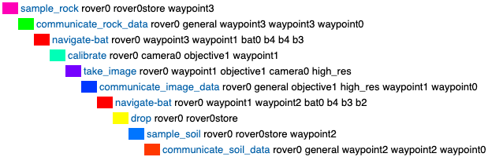
 
    </td>
    <td style="border: hidden;">
      
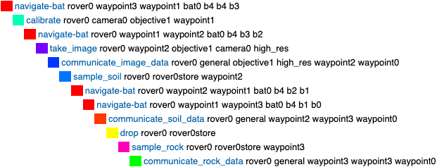
 
    </td>    
  </tr>
  <tr style="background-color: white">
    <td style="border: hidden;">
      
<i>Figura 4 - Solución encontrada por el planificador BFWS para el problema roverprob1234</i>

    </td>
    <td style="border: hidden;">
      
<i>Figura 5 - Solución encontrada por el planificador LAMA para el problema roverprob1234</i>

    </td>
  </tr>
</table>

**BFWS** **(*Best-First Width Search*)** organiza la expansión de nodos en función de un criterio de **novedad**, es decir, priorizando estados que introducen hechos nuevos. Esta organización permite una exploración amplia y rápida del espacio de estados, sin necesidad de profundizar innecesariamente en ramas poco prometedoras. Dentro de cada capa, usa la heurística *Fast Forward (FF)* para guiar la selección de nodos. Esta combinación favorece la rapidez en dominios donde no existen costes diferenciados, como en  este ejercicio (Lipovetzky & Geffner, 2017).

**LAMA**, en cambio, aplica una búsqueda *greedy best-first* informada por *landmarks* y la heurística FF. Identifica hechos que deben alcanzarse en todo plan válido (*landmarks*) y los usa para construir una función heurística más dirigida. Al ser un planificador *anytime*, sigue buscando mejoras tras hallar una primera solución, aunque en este caso no se obtienen versiones más eficientes (Richter & Westphal, 2010).

*Tabla 1 – Comparativa de los planificadores BFWS y LAMA aplicados al problema roverprob1234*

  <table border="1" cellpadding="5" cellspacing="0" style="border-collapse: collapse;">
    <tr style="background-color: #0098CD; color:white; text-align: center;">
      <th>Planificador</th>
      <th>Coste</th>
      <th>Acciones</th>
      <th>Fluents</th>
      <th>Tiempo (s)</th>
      <th>Nodos Generados</th>
      <th>Nodos Expandidos</th>
    </tr>
    <tr style="background-color:white" align="center">
      <td><strong>BFWS</strong></td>
      <td>10</td>
      <td>10</td>
      <td>40</td>
      <td>2.950</td>
      <td>93</td>
      <td>42</td>
    </tr>
    <tr style="background-color:white" align="center">
      <td><strong>LAMA</strong></td>
      <td>12</td>
      <td>12</td>
      <td>33</td>
      <td>4.410</td>
      <td>87</td>
      <td>17</td>
    </tr>
  </table>

Como se observa en la [Tabla 1](#Tabla_1), ambos planificadores encuentran soluciones válidas, aunque con comportamientos significativamente diferentes. **BFWS** destaca por su rapidez, alcanzando la solución en un tiempo inferior pese a generar y expandir un número mayor de nodos. Esta exploración más amplia del espacio de estados está alineada con su estrategia basada en la novedad, que prioriza la expansión de estados que introducen hechos nuevos.

Por su parte, **LAMA** muestra una mayor eficiencia espacial, ya que expande muchos menos nodos gracias al uso combinado de *landmarks* y la heurística FF, que guían la búsqueda hacia estados más prometedores. Sin embargo, este comportamiento implica un mayor tiempo de cómputo y produce un plan ligeramente más largo.

En este escenario inicial, donde no existen costes diferenciados y el objetivo principal es obtener una solución válida en el menor tiempo posible, **BFWS resulta más ventajoso desde el punto de vista temporal**, mientras que **LAMA sobresale por su eficiencia en la exploración del espacio de búsqueda**.

## 3. Modificación del estado inicial y objetivos

En este bloque se profundiza en la capacidad de adaptación de un modelo PDDL mediante la incorporación de nuevos elementos al entorno y la redefinición de los objetivos del problema. Estas modificaciones permiten explorar cómo afectan los cambios estructurales y funcionales tanto al espacio de estados como al comportamiento del planificador, evaluando su capacidad para gestionar escenarios más complejos y exigentes. Al ampliar el mapa, introducir nuevos recursos y redefinir la meta, se pone a prueba la flexibilidad del dominio y la potencia de los algoritmos de planificación para generar soluciones válidas en contextos dinámicos y en continua evolución.

### 3.1. Nuevo waypoint con muestras

En esta parte se amplía el mapa del entorno mediante la incorporación de un nuevo punto de interés, `waypoint4`, que representa una ubicación accesible y relevante para el análisis del terreno. Este nuevo *waypoint* se ha añadido a la lista de objetos del tipo `waypoint`, permitiendo así su uso en las distintas acciones del dominio.

Para garantizar su conectividad, se ha declarado la capacidad de movimiento del rover hacia y desde `waypoint4`, estableciendo enlaces bidireccionales mediante el predicado `can_traverse` con `waypoint0` y `waypoint2`, manteniendo la coherencia estructural del mapa original. Del mismo modo, se ampliaron las relaciones de visibilidad entre `waypoint4` y el resto de ubicaciones del entorno mediante el predicado `visible`, de forma que el nuevo punto quede integrado visualmente como el resto, evitando limitaciones en acciones que dependen de esta propiedad.

Además, se colocaron muestras de suelo y roca en `waypoint4` mediante los predicados `(at_soil_sample waypoint4)` y `(at_rock_sample waypoint4)`, lo que habilita las acciones **`sample_soil`** y **`sample_rock`** en ese punto. Por otra parte, aunque se valoró inicialmente declarar visibilidad desde `waypoint4` hacia algunos objetivos de cámara, esta opción fue descartada al confirmarse que no se realizan tareas de imagen desde esa ubicación. De este modo, se evita la inclusión de relaciones innecesarias, lo que contribuye a simplificar el modelo y mejorar la eficiencia del planificador.

Finalmente, se modificaron los objetivos del problema para exigir la comunicación de ambas muestras recogidas en el nuevo punto, así como una condición adicional que obliga a que el rover finalice su misión en `waypoint1`.

### 3.2. Inclusión de un segundo rover

En esta parte se amplía el problema original añadiendo un segundo rover (`rover1`) equipado con capacidades de análisis de suelo y roca, toma de imágenes y desplazamiento. Para ello, se incorporan también su almacén de muestras (`rover1store`) y una segunda cámara (`camera1`), ambos necesarios para que el nuevo rover pueda participar plenamente en las tareas del plan.

El nuevo rover se ubica inicialmente en `waypoint3`, junto a `rover0`, bajo la suposición de que ambos vehículos han sido desplegados conjuntamente. Se declara como disponible, con batería cargada (`b4`) e instalaciones completas. Se replican las rutas de navegación mediante `can_traverse`, garantizando simetría en el acceso al entorno. La cámara adicional se calibra sobre `objective0`, permitiendo cubrir ambos objetivos en los modos `high_res` y `colour` sin conflictos de calibración.

Finalmente, se ha ampliado el conjunto de objetivos del problema para exigir la comunicación de **todas las muestras de suelo y roca** presentes en el entorno, así como la **captura y transmisión de imágenes** de ambos objetivos en los dos modos disponibles (`high_res` y `colour`). Esta definición obliga al planificador a generar un plan completo que cubra tanto la adquisición como la comunicación de todos los datos científicos relevantes, aprovechando la cooperación entre los dos rovers.

## 4. Ejecución y evaluación del planificador

En este bloque se examina el comportamiento de los planificadores al aplicarlos a distintas variantes del problema, evaluando tanto la calidad de los planes obtenidos como la eficiencia computacional mostrada en cada caso. El análisis comparado permite observar cómo reaccionan los algoritmos ante cambios en el entorno, en la complejidad de los objetivos o en la estructura del estado inicial, revelando diferencias significativas en sus estrategias internas de búsqueda y en la manera en que gestionan los recursos disponibles. A partir de esta evaluación es posible comprender con mayor profundidad las fortalezas y limitaciones de cada planificador, así como su adecuación a distintos escenarios dentro del dominio estudiado.

### 4.1. Análisis del plan generado para el caso 2.1

Como se observa en la [Tabla 2](#Tabla_2), ambos planificadores generan planes válidos que cumplen los objetivos, aunque con diferencias notables en coste, eficiencia y comportamiento. LAMA obtiene un plan más corto y con menor coste, mientras que BFWS genera una solución más extensa, con más movimientos y acciones intermedias.

*Tabla 2 – Comparativa de los planificadores BFWS y LAMA aplicados al problema roverprob1234 parte 1.2*

  <table border="1" cellpadding="5" cellspacing="0" style="border-collapse: collapse;">
    <tr style="background-color: #0098CD; color:white; text-align: center;">
      <th>Planificador</th>
      <th>Coste</th>
      <th>Acciones</th>
      <th>Fluents</th>
      <th>Tiempo (s)</th>
      <th>Nodos Generados</th>
      <th>Nodos Expandidos</th>
    </tr>
    <tr style="background-color:white" align="center">
      <td><strong>BFWS</strong></td>
      <td>23</td>
      <td>23</td>
      <td>47</td>
      <td>2.900</td>
      <td>510</td>
      <td>324</td>
    </tr>
    <tr style="background-color:white" align="center">
      <td><strong>LAMA</strong></td>
      <td>21</td>
      <td>21</td>
      <td>42</td>
      <td>3.205</td>
      <td>313</td>
      <td>58</td>
    </tr>
  </table>

A nivel computacional, LAMA destaca por su eficiencia espacial, generando y expandiendo menos nodos gracias a sus heurísticas basadas en *landmarks*, que orientan la búsqueda hacia estados relevantes. Esta ventaja conlleva mayor coste temporal por el mantenimiento de dichas heurísticas. BFWS, en cambio, encuentra la solución más rápido gracias a su enfoque basado en la novedad de los estados y una heurística secundaria ligera, aunque produce planes menos estructurados.

En el caso inicial del apartado 2, ambos ofrecían planes con el mismo coste, aunque con enfoques distintos. En este caso, las nuevas restricciones penalizan a BFWS, que carece de una guía heurística suficientemente informada para reorganizar eficientemente las tareas, mientras que LAMA integra los nuevos objetivos de forma más coherente.

La [Figura 6](#Figura_6) muestra que el plan de BFWS incluye desplazamientos redundantes, como la secuencia $3 \rightarrow 1 \rightarrow 2 \rightarrow 4 \rightarrow 0 \rightarrow 3 \rightarrow 1 \rightarrow 2 \rightarrow 1$, con regresos a *waypoints* ya visitados. Este comportamiento refleja su prioridad por hechos novedosos sin evaluar el impacto global. En contraste, la [Figura 7](#Figura_7) evidencia que LAMA genera una ruta más compacta, del tipo $3 \rightarrow 1 \rightarrow 2 \rightarrow 4 \rightarrow 0 \rightarrow 3 \rightarrow 1$, agrupando tareas de forma más lógica. Aunque también repite pasos, estos responden a restricciones del dominio, como vaciar el *store* o comunicar datos.

LAMA resulta más adecuado en este escenario al ofrecer un plan de mayor calidad y eficiencia global.

<table>
  <tr style="background-color: white">
    <td style="border: hidden;">
      
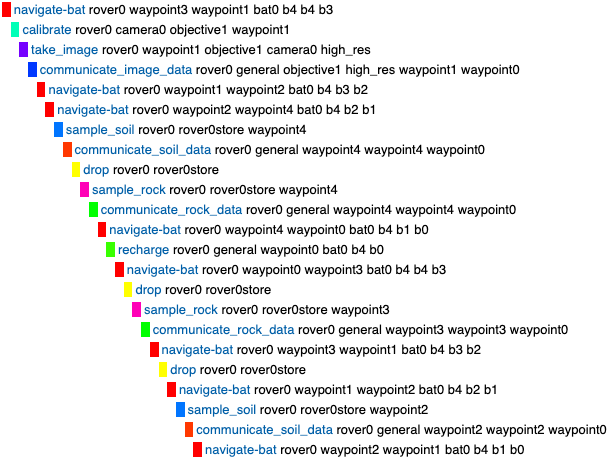
 
    </td>
    <td style="border: hidden;">
      
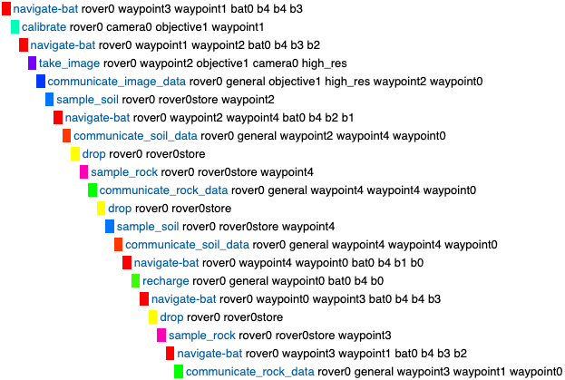
 
    </td>    
  </tr>
  <tr style="background-color: white">
    <td style="border: hidden;">
      
<i>Figura 6 - Solución encontrada por el planificador BFWS para el problema roverprob1234 parte 2.1</i>

    </td>
    <td style="border: hidden;">
      
<i>Figura 7 - Solución encontrada por el planificador LAMA para el problema roverprob1234 parte 2.1</i>

    </td>
  </tr>
</table>

### 4.2. Análisis del plan generado para el caso 2.2

Como se recoge en la [Tabla 3](#Tabla_3), ambos planificadores generan un plan de coste 32 compuesto por el mismo número de acciones. Sin embargo, presentan diferencias relevantes en términos de eficiencia y comportamiento interno. BFWS produce únicamente 63 *fluents*, frente a los 80 generados por LAMA.

*Tabla 3 – Comparativa de los planificadores BFWS y LAMA aplicados al problema roverprob1234 parte 2.2*

  <table border="1" cellpadding="5" cellspacing="0" style="border-collapse: collapse;">
    <tr style="background-color: #0098CD; color:white; text-align: center;">
      <th>Planificador</th>
      <th>Coste</th>
      <th>Acciones</th>
      <th>Fluents</th>
      <th>Tiempo (s)</th>
      <th>Nodos Generados</th>
      <th>Nodos Expandidos</th>
    </tr>
    <tr style="background-color:white" align="center">
      <td><strong>BFWS</strong></td>
      <td>32</td>
      <td>32</td>
      <td>63</td>
      <td>2.920</td>
      <td>496</td>
      <td>213</td>
    </tr>
    <tr style="background-color:white" align="center">
      <td><strong>LAMA</strong></td>
      <td>32</td>
      <td>32</td>
      <td>80</td>
      <td>3.215</td>
      <td>1189</td>
      <td>101</td>
    </tr>
  </table>

El tiempo de resolución de LAMA es ligeramente superior, aunque la diferencia con BFWS es menor que en pruebas anteriores. A cambio, destaca por su eficiencia espacial, ya que expande menos de la mitad de nodos que BFWS, pese a generar un volumen considerablemente mayor. Este comportamiento refleja una exploración más selectiva del espacio de búsqueda gracias a su gestión heurística.

Ambos planes cumplen correctamente con los requisitos del problema, distribuyendo eficazmente las tareas entre `rover0` y `rover1`. Aunque el modelo de costes asume acciones secuenciales, ambos planificadores generan soluciones compatibles con una posible ejecución paralela, asignando funciones complementarias de análisis, captura y transmisión de datos a los dos agentes.

En ambos casos se observa un desplazamiento final de `rover0` desde `waypoint0` a `waypoint3` para comunicar datos al *lander*. Aunque este movimiento puede parecer redundante, se explica por una omisión en la definición del problema, donde la ausencia del predicado `(visible waypoint0 waypoint0)` impide la comunicación directa desde su posición final.

Además, en el plan generado por LAMA, la captura de imágenes con objetivos distintos a los utilizados en la calibración no infringe ninguna restricción, ya que el dominio no impone dicha condición.

En términos prácticos, si la memoria disponible no es una limitación, LAMA constituye una opción preferente por su menor número de expansiones. En cambio, en entornos más restringidos o donde se priorice la rapidez y simplicidad en la exploración, BFWS sigue siendo una alternativa eficaz.

## 5.   Modificación del dominio

Este bloque aborda la ampliación y reestructuración del dominio con el objetivo de incorporar nuevos elementos que permitan modelar situaciones más completas y realistas dentro del entorno de planificación. La inclusión de capacidades avanzadas de movilidad, restricciones basadas en el terreno y mecanismos de cooperación entre rovers introducen un nivel adicional de complejidad que desafía tanto al modelado como a los propios planificadores. A través de estas modificaciones se exploran las posibilidades de extender un dominio de forma coherente, asegurando que las nuevas dinámicas interactúen correctamente con las ya existentes y evaluando cómo los algoritmos de planificación responden ante un espacio de estados más rico y estructurado. Este análisis permite valorar la solidez del diseño del dominio y la capacidad de los planificadores para adaptarse a escenarios más exigentes.

  

### 5.1. Descripción de los nuevos elementos introducidos

Para adaptar el dominio a un entorno más realista, se ha incorporado un modelo de movilidad diferenciado por tipos de tracción y condiciones del terreno, así como capacidades cooperativas entre rovers mediante remolque. Cada rover dispone ahora de un tipo de tracción específico (*wheels*, *tracks* o *legs*), definido con el predicado `has_traction`, que condiciona su capacidad para desplazarse por distintos tipos de caminos. A su vez, cada conexión entre *waypoints* se clasifica mediante `path_type` como *flat*, *rocky*, *sandy* o *slope*, y la transitabilidad se controla de forma genérica mediante `valid_traversal`, que relaciona tracción y terreno sin necesidad de acoplar restricciones a rovers concretos. Estas modificaciones reemplazan el enfoque anterior basado en `can_traverse`, facilitando una arquitectura modular y escalable. Por ejemplo, *wheels* permiten circular por caminos planos y en pendiente, *tracks* por arena y pendiente, y *legs* por zonas rocosas. La acción **`navigate`** ha sido modificada para validar estas restricciones de forma explícita.

Asimismo, se ha implementado un sistema de remolque que permite a un rover transportar a otro a través de terrenos inaccesibles para este último. Esta capacidad se modela mediante los predicados `tug_of`, `valid_tug_pair`, `towing`, `empty_tug` y `full_tug`, y se operacionaliza con las acciones **`tug_rover`**, **`tow_navigate`** y **`detach`**. El remolque se establece entre dos rovers disponibles en el mismo *waypoint* mediante **`tug_rover`**, se ejecuta el movimiento conjunto con **`tow_navigate`**, consumiendo energía solo del rover que remolca, y se libera con **`detach`**, restaurando la disponibilidad operativa del rover remolcado. En este modelo se ha asumido que el remolque representa una asistencia al desplazamiento, pero no restringe la autonomía funcional del rover una vez alcanza su destino. Por tanto, puede seguir realizando tareas científicas como la toma de muestras o la captura de imágenes.

El nuevo problema ha sido diseñado para activar de forma efectiva todas estas funcionalidades. Cada rover dispone de una tracción específica, y los caminos están etiquetados con distintos tipos de terreno, lo que obliga a planificar rutas acordes a sus capacidades. Se incluyen restricciones de visibilidad entre *objectives* y *waypoints* para evitar soluciones triviales, y se fuerza la colaboración entre rovers mediante el uso de `tow_navigate` en caminos inaccesibles para algunos de ellos. Las conexiones del mapa se representan en la [Figura 12](#Figura_12) mediante un grafo etiquetado, y en la [Figura 13](#Figura_13) sobre un mapa realista del terreno marciano.

<table>
  <tr style="background-color: white">
    <td style="border: hidden;">
      
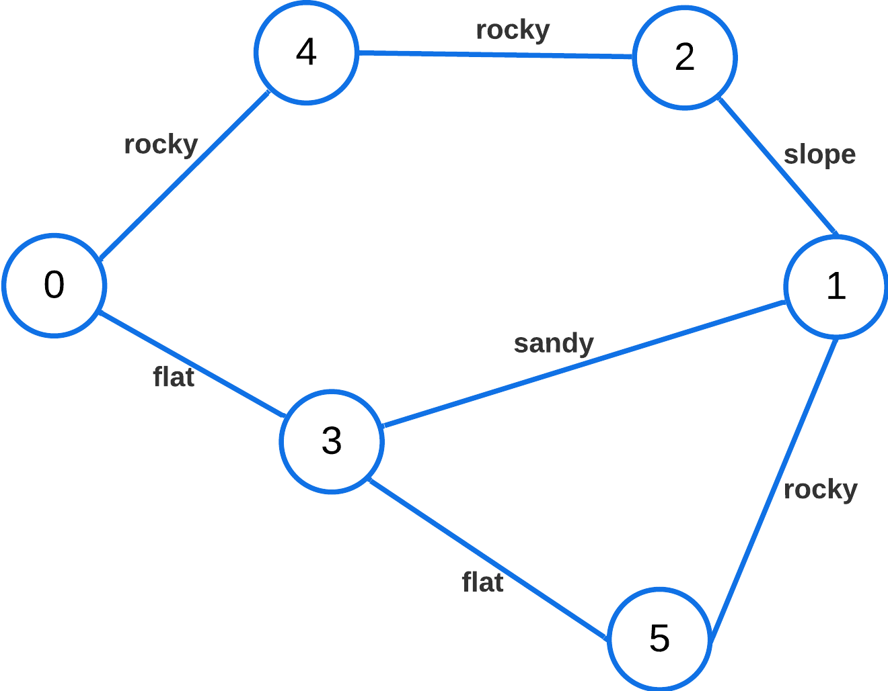
 
    </td>
    <td style="border: hidden;">
      
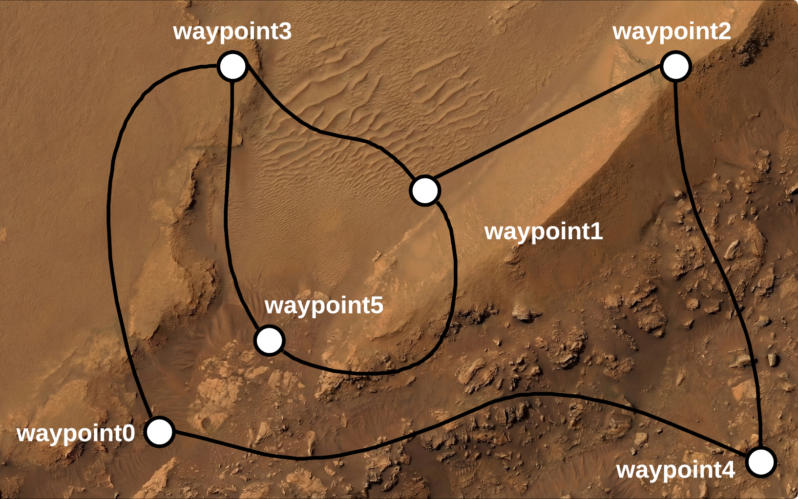
 
    </td>    
  </tr>
  <tr style="background-color: white">
    <td style="border: hidden;">
      
<i>Figura 12 - Grafo del problema roverprob1234 parte 4</i>

    </td>
    <td style="border: hidden;">
      
<i>Figura 13 - Representación espacial del problema roverprob1234 parte 4</i>

    </td>
  </tr>
</table>

El bloque **`:goal`** exige la comunicación de muestras de suelo y roca de distintas ubicaciones, así como imágenes en modos `color` y `high_res` de varios objetivos, garantizando así la activación de todos los elementos del dominio extendido y permitiendo una evaluación completa de su coherencia lógica bajo condiciones exigentes.

### 5.2. Ejecución del planificador y análisis del resultado

Ambos planificadores generan planes válidos que satisfacen todos los objetivos del problema, integrando correctamente las nuevas funcionalidades del dominio. Como se recoge en la [tabla 4](#Tabla_4), el coste total difiere ligeramente entre ambos, siendo BFWS el que ofrece la solución más compacta.

*Tabla 4 – Comparativa de los planificadores BFWS y LAMA aplicados al problema roverprob1234 parte 4*

  <table border="1" cellpadding="5" cellspacing="0" style="border-collapse: collapse;">
    <tr style="background-color: #0098CD; color:white; text-align: center;">
      <th>Planificador</th>
      <th>Coste</th>
      <th>Acciones</th>
      <th>Fluents</th>
      <th>Tiempo (s)</th>
      <th>Nodos Generados</th>
      <th>Nodos Expandidos</th>
    </tr>
    <tr style="background-color:white" align="center">
      <td><strong>BFWS</strong></td>
      <td>42</td>
      <td>42</td>
      <td>156</td>
      <td>3.212</td>
      <td>1971</td>
      <td>814</td>
    </tr>
    <tr style="background-color:white" align="center">
      <td><strong>LAMA</strong></td>
      <td>44</td>
      <td>44</td>
      <td>204</td>
      <td>3.552</td>
      <td>3670</td>
      <td>181</td>
    </tr>
  </table>

En cuanto al tiempo de ejecución, ambos presentan un rendimiento similar, con una duración total próxima a los 3,5 segundos. Desde el punto de vista de la memoria, BFWS genera un mayor número de nodos, lo que sugiere una exploración más amplia del espacio de búsqueda. Por el contrario, LAMA expande muchos menos nodos, reflejando una mayor capacidad de selección durante la exploración. No obstante, pese a esta aparente eficiencia, el plan generado por LAMA presenta un coste superior, lo que resulta llamativo dado su enfoque orientado a la calidad.

El número de *fluents* activos también muestra diferencias. LAMA mantiene un mayor número de condiciones intermedias a lo largo del plan, lo que sugiere una estructura más encadenada y secuencial, basada en la preservación de ciertos estados hasta alcanzar subobjetivos clave.

En lo relativo a la calidad del plan generado, LAMA incurre en un movimiento innecesario, cuando `rover0` se desplaza desde `waypoint3` hasta `waypoint0` antes de iniciar el remolque de `rover2`, para luego regresar, acoplarlo y repetir el trayecto (ver [Figura 9](#Figura_9)). Esta secuencia implica una duplicación del desplazamiento que podría haberse evitado. Por el contrario, BFWS evita este recorrido redundante y realiza el remolque de manera más directa, como puede observarse en la [Figura 8](#Figura_8).

<table>
  <tr style="background-color: white">
    <td style="border: hidden;">
      
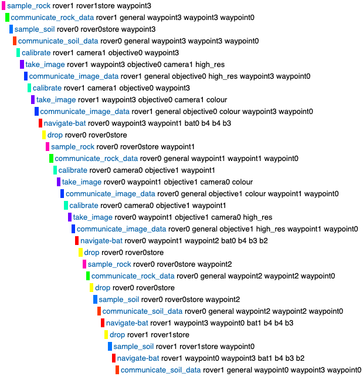
 
    </td>
    <td style="border: hidden;">
      
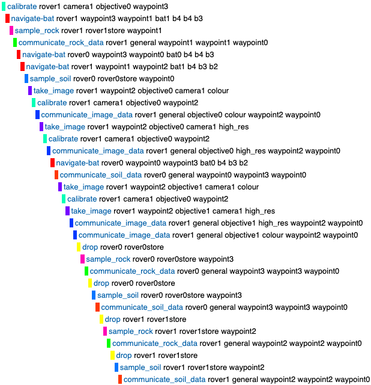
 
    </td>     
  </tr>
  <tr style="background-color: white">
    <td style="border: hidden;">
      
<i>Figura 8 - Solución encontrada por el planificador BFWS para el problema roverprob1234 parte 2.2</i>

    </td>
    <td style="border: hidden;">
      
<i>Figura 9 - Solución encontrada por el planificador LAMA para el problema roverprob1234 parte 2.2</i>

    </td>
  </tr>
</table>

## Referencias

Lipovetzky, N., & Geffner, H. (2017). Best-First Width Search: Exploration and Exploitation in Classical Planning. *Proceedings of the AAAI Conference on Artificial Intelligence*, *31*(1), 3590-3596. https://doi.org/10.1609/AAAI.V31I1.11027

Richter, S., & Westphal, M. (2010). The LAMA Planner: Guiding Cost-Based Anytime Planning with Landmarks. *Journal of Artificial Intelligence Research*, *39*, 127-177. https://doi.org/10.1613/JAIR.2972

## Anexo A. Figuras complementarias

<table border="1" style="border-collapse: collapse;">
  <tr style="background-color: white">
    <td style="border: 1px solid black;">
      
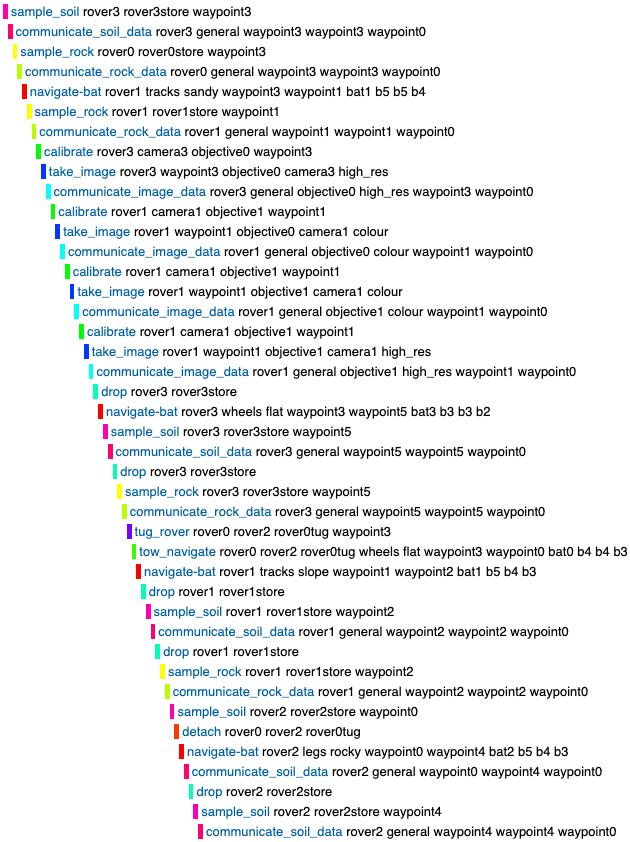

    </td>
  </tr>
  <tr style="background-color: white">
    <td style="border-left:hidden; border-right:hidden; border-bottom: hidden;">
      

        <i>Figura 10 - Solución encontrada por el planificador BFWS para el problema roverprob1234 parte 4</i>
      

    </td>
  </tr>
</table>

<table border="1" style="border-collapse: collapse;">
  <tr style="background-color: white">
    <td style="border: 1px solid black;">
      
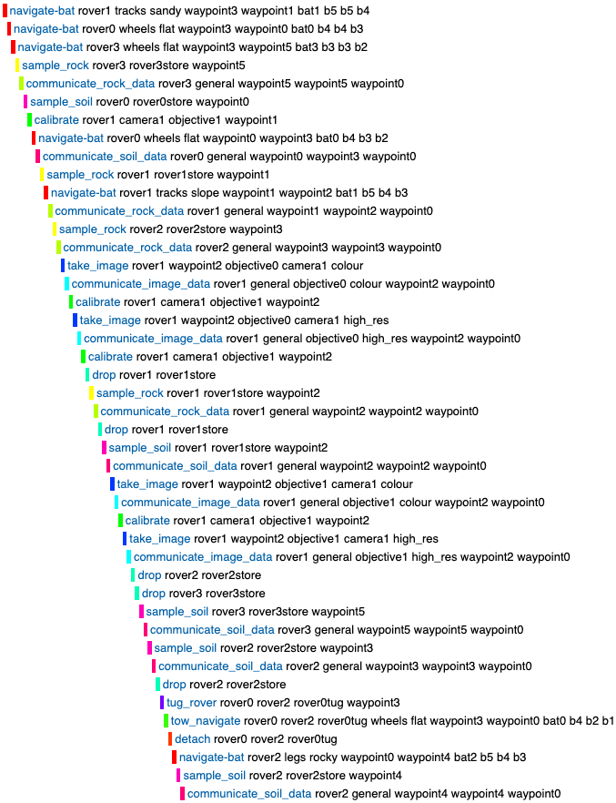

    </td>
  </tr>
  <tr style="background-color: white">
    <td style="border-left:hidden; border-right:hidden; border-bottom: hidden;">
      

        <i>Figura 11 - Solución encontrada por el planificador BFWS para el problema roverprob1234 parte 4</i>
      

    </td>
  </tr>
</table>
